# 02_软件开发正式开发指导

**版本**：v1.0
**日期**：2026-08-22
**适用对话**：`02_软件开发`
**项目总控**：`01_项目总控与决策`
**当前状态**：M1—M5已由01完成正式审查和集成。M3完成React专业Agent工作台，M4完成LangGraph/LangChain Core可恢复工作流，M5完成记录级准入、SQLite/FTS5确定性检索、运行级知识冻结和知识依据面板。M5终审见[`M5_DEVELOPMENT_REVIEW.md`](M5_DEVELOPMENT_REVIEW.md) v1.0。M6专项执行说明已经形成于[`M6_DEVELOPMENT_PROMPT.md`](M6_DEVELOPMENT_PROMPT.md) v1.0，但M6软件开发尚未启动；新02 M6任务只有收到精确口令后才能实施。

## 1. 文件定位与开发门槛

本文件是02_软件开发在获得开发授权后的当前执行依据，结合 [`PROJECT_PLAN.md`](PROJECT_PLAN.md)、[`DATA_STATUS.md`](DATA_STATUS.md)、[`DATA_PROFILE.md`](DATA_PROFILE.md)、[`DATA_CONTRACT.md`](DATA_CONTRACT.md) 和 [`DATA_AUDIT_REVIEW_AND_FLOW_READINESS.md`](DATA_AUDIT_REVIEW_AND_FLOW_READINESS.md) 使用。

`01_项目总控与决策`只负责审查、方案、决策、状态、正式合并和Git操作，不承担日常软件编码；本文件中的程序实现统一由`02_软件开发`执行。本轮01只更新开发指导，不修改02现有程序、不安装依赖、不制作网页或桌面软件。02继续开发仍应遵守项目开发授权和成果审查流程。

本文件执行D-024确认的11行业统一覆盖范围；第一里程碑只是先打通数据登记、校验、展示、规则匹配和基础报告闭环，不代表缩减最终MVP。行业可以按成熟度分批实现，但最终采用相同的来源、版本、证据、测试和人工复核门槛。

## 2. 当前项目目标与软件问题

项目目标是形成面向金融机构和企业的、可运行、可测试、可追溯的企业转型金融评估系统。系统用于辅助转型主体识别、能耗与碳排放核算、转型计划可信度判断、风险提示、证据追溯和企业改进建议，不自动作出授信通过或拒绝决定。

软件第一阶段要解决的问题是：

- 配套Excel能否被安全登记并完成五张表的结构和关联校验；
- 能否以企业代号查看企业基本信息、能源活动、经营指标和补充信息；
- 能否明确展示2024—2025年能耗/经营变化、缺失数据、单位和质量问题，而不是静默补零；
- 能否利用`转型目录`生成可解释的转型路径候选和匹配依据；
- 能否生成一份标注“模拟数据、不代表真实企业业务”的基础评估报告；
- 能否把`转型规划结论`隔离为参考答案、验证对照或测试基准，防止目标泄漏。

## 3. 当前已取得的数据

当前工作簿为命题方提供的脱敏、模拟生成比赛开发测试数据，不是真实企业业务数据。工作簿文件登记、哈希和结构见 [`DATA_STATUS.md`](DATA_STATUS.md)。

| 工作表 | 初步规模 | 用途 | 约束 |
|---|---:|---|---|
| `基本信息` | 6字段、1000行 | 企业基本资料、行业路由和企业详情 | `企业代号`必须唯一且可跨表关联 |
| `能耗信息` | 22字段、1000行 | 2024—2025年能源、产量和营业收入输入 | 单位、年度、缺失状态必须随数据展示 |
| `补充信息` | 10字段、1000行 | 产品/服务、设备、管理措施、痛点和转型诉求 | 自由文本须保留原文并标记可核验状态 |
| `转型目录` | 4字段、656行 | 行业规则与知识来源、路径候选 | 当前无显式稳定ID，来源/版本/生效期待补 |
| `转型规划结论` | 9字段、1000行 | 参考答案、验证对照、人工审阅基准 | 不得进入同一模型输入或标签生成链路 |

四张企业表的`企业代号`初步审计为`TF0001`—`TF1000`一一闭合；具体缺失、单位、语义和目录覆盖问题见 [`DATA_PROFILE.md`](DATA_PROFILE.md)。

## 4. 程序输入边界

### 4.1 可以进入输入层的数据

第一阶段可以读取并标准化：

1. `基本信息`；
2. `能耗信息`；
3. `补充信息`。

这些数据进入输入层前必须完成文件哈希登记、表头校验、企业代号校验、类型/单位检查、缺失状态标记和质量问题留痕。配套数据的模拟属性必须随批次保留。

### 4.2 不能直接作为模型输入的数据

`转型规划结论`除企业代号外的所有字段，只能用于：

- 参考答案展示；
- 规则/流程回放；
- 测试基准和对照验证；
- 人工审阅和差异报告。

它不得直接进入训练特征、推理特征、特征工程中间表、标签生成链路或任何会影响同一模型输入的缓存。建议实现独立的`reference_planning_output`或等价隔离层，并对特征视图引用执行泄漏检查。

### 4.3 `转型目录`的使用方式

`转型目录`不是普通模型输入，而是规则/知识来源：

- 以行业、细分行业/领域、产品/服务等信息产生候选路径；
- 展示命中的目录行、匹配字段、匹配原因和歧义状态；
- 不得只保存路径编号，因为同一行业存在编号复用；
- 开发阶段可使用临时行级标识，但正式`rule_id`、来源、版本、生效日期、适用范围和权威标准仍待确认；
- 目录覆盖缺口和路径歧义必须进入质量问题或人工复核，不得静默选定或编造路径。

## 5. 当前数据缺失、字段冲突与注意事项

### 5.1 缺失与范围

- 电力192、煤炭548、天然气318、热力556、柴油725、汽油950、水215、主要产品产量699家企业存在2024/2025成对缺失；营业收入无缺失。
- 产量和产量单位缺失699行完全一致；不能把缺失产量自动改为0。
- 绿电比例初步位于0—1；消费量、产量和营业收入未发现负数或零值，但仍需保留质量检查。
- 561家企业设备年限超过“2025年减成立年份”，第一阶段只提示警告，不直接拒绝数据。

### 5.2 字段冲突和口径缺口

- `主要用能来源`只描述主要来源，不是完整能源清单；144家企业的数值能源项多于文本列出的主要来源，第一阶段显示软校验问题。
- `细分行业/领域`与`主要产品/服务`不能互相覆盖；两者逐行完全相同仅240/1000。
- 工作簿没有组织边界、核算边界、Scope 1/2、温室气体种类、排放因子ID/版本、折标系数、设备年限截至日期、币种和完整期间口径；第一阶段不得宣称正式碳排放核算。
- 产量单位—行业对应关系只属于工作簿观察，必须显示“待数据字典确认”。
- `转型目录`存在钢铁、煤电、纺织类别为空，以及农业、石化和水上运输分类覆盖缺口；第一阶段显示缺口，不自行补目录。

## 6. 第一开发里程碑

**里程碑名称**：M1 配套Excel数据评估流程闭环（待开发授权）

**目标**：完成“Excel上传 → 五张表结构校验 → 按企业代号关联 → 企业详情展示 → 2024—2025年能耗变化分析 → 缺失数据提示 → 转型目录匹配 → 基础评估报告生成 → 与`转型规划结论`对照验证”的可重复闭环。

**不把评分得分作为M1完成条件**。M1的结果是可解释的数据质量、规则匹配和参考结论对照流程。

## 7. M1必须完成的功能与验收标准

| 编号 | 功能 | 最低验收标准 |
|---|---|---|
| M1-01 | Excel上传与批次登记 | 能接收`.xlsx`；生成批次ID；记录来源、文件名、大小、SHA-256、模拟数据标识和接收时间；原始文件只读保存，不上传Git |
| M1-02 | 五表结构校验 | 检查五张表名称、必需表头、字段类型和基本范围；缺表、多表、表头变化、非法类型均产生可读问题，不静默跳过 |
| M1-03 | 企业代号关联 | 以`企业代号`关联四张企业表；重复、空键、孤儿键、行数/集合不一致可定位到批次和表；通过后生成企业索引 |
| M1-04 | 企业详情展示 | 输入一个企业代号后展示基本信息、补充信息、2024/2025能源和经营数据、单位、缺失状态和质量问题；不把参考结论混入输入区 |
| M1-05 | 年度能耗变化 | 按能源类型展示2024与2025原始值、单位、变化值/变化率和缺失状态；缺失不当作零；未取得因子和边界前不输出正式碳排放量 |
| M1-06 | 缺失与质量提示 | 展示成对缺失、产量/单位配对、能源数量软校验、设备年限警告、单位/类型异常和目录歧义；每条问题包含企业、字段、严重度、原值和处理状态 |
| M1-07 | 转型目录匹配 | 根据行业/细分领域/产品信息给出候选目录行；展示匹配依据、目录行临时ID、歧义和覆盖缺口；不得只按路径编号静默匹配 |
| M1-08 | 基础评估报告 | 输出模拟数据声明、输入摘要、质量问题、年度变化、目录候选、待补材料和人工复核项；不输出最终评分权重、授信结论或真实效果 |
| M1-09 | 参考结论对照 | 独立加载`转型规划结论`，展示参考字段与流程结果的差异/一致性；测试能证明参考字段没有进入输入特征或标签生成链路 |
| M1-10 | 可重复运行与审计 | 同一批次、同一输入和同一规则版本可重复产生一致输出；记录处理状态、错误信息、规则版本和报告生成时间 |

## 8. 输入、输出和接口要求

### 8.1 输入

- 单个配套`.xlsx`文件及其批次元数据；
- 五张工作表和当前登记的表头/字段契约；
- 企业代号查询条件；
- 目录匹配所需的行业、细分行业/领域和产品/服务字段；
- 参考结论对照开关，默认开启但保持独立数据层。

### 8.2 输出

- 批次登记记录和文件哈希；
- 五表结构检查结果；
- 企业关联结果和企业详情；
- 2024/2025能源及经营变化表；
- 缺失、冲突、异常和待确认问题清单；
- 目录候选路径、匹配依据和歧义状态；
- 基础评估报告和参考结论对照报告。

所有输出必须标注“命题方脱敏模拟数据，仅用于比赛开发测试，不代表真实企业业务数据”。

### 8.3 候选接口

沿用项目既有接口方向，并为M1限定最小范围：

- `POST /api/v1/documents`：登记并保存上传文件元数据；
- `GET /api/v1/jobs/{job_id}`：查询结构校验、关联和质量检查进度；
- `GET /api/v1/companies/{company_code}`：读取企业详情和质量问题；
- `GET /api/v1/companies/{company_code}/energy-trend`：读取2024/2025能源和经营变化；
- `GET /api/v1/companies/{company_code}/catalog-matches`：读取目录候选及匹配依据；
- `POST /api/v1/reports/basic`：生成基础评估和参考结论对照报告。

接口响应应包含批次ID、数据状态、模拟数据标识、规则版本、质量问题引用和错误码；不得返回未标注来源的最终评分或授信结论。

### 8.4 M2工作空间、运行、对比与报告接口

M2不得继续把`task_id`作为唯一业务对象。后端至少提供以下资源方向，具体路径可在实现时保持REST语义一致：

| 资源 | 接口方向 | 主要约束 |
|---|---|---|
| 工作空间 | `POST/GET /api/v1/workspaces` | 工作空间只保存对话和运行索引，不直接混合不同企业事实 |
| 评估运行 | `POST/GET /api/v1/workspaces/{workspace_id}/runs` | 每个运行必须绑定一个`enterprise_id`、批次、规则版本和模型配置 |
| 当前企业 | `PUT /api/v1/runs/{run_id}/enterprise` | 运行创建后不可静默改绑；改绑必须新建运行并保留旧运行 |
| 对话消息 | `POST/GET /api/v1/runs/{run_id}/messages` | 消息只能写入当前运行，模型上下文不得跨运行读取企业事实 |
| 对比视图 | `POST /api/v1/comparisons` | 只接受已完成运行；记录比较口径、版本差异和不可比原因 |
| 报告成果 | `POST/GET /api/v1/runs/{run_id}/reports` | 报告按运行独立生成，保存路径、版本、哈希和生成配置 |
| 报告导出 | `POST /api/v1/reports/{report_id}/export` | 默认保存应用数据目录，也允许用户选择导出目录 |

所有运行、工具、消息、报告和对比接口必须返回`workspace_id`、`assessment_run_id`、`enterprise_id`、批次ID、模拟数据标识和规则/模型版本；跨运行资源访问必须返回可读错误，不得静默回退到“当前任务”。

## 9. 推荐目录结构与模块边界

以下是开发授权后的建议结构，不要求当前创建目录：

```text
code/
  python/
    app/
      api/             # M1最小HTTP接口与错误码
      ingestion/       # 文件登记、XLSX读取、批次元数据
      schemas/         # 输入、输出、质量问题和报告数据结构
      validation/      # 表头、类型、主键、关联、缺失和范围校验
      company/         # 企业索引、详情和年度变化查询
      catalog/         # 转型目录加载、匹配、歧义和覆盖提示
      reference/       # 转型规划结论隔离、对照和泄漏检查
      reporting/       # M1基础报告和模拟数据声明
      audit/           # 处理日志、问题状态、规则/批次记录
    tests/
      unit/
      integration/
      fixtures/        # 仅放获准的最小测试样例，不放原始配套数据
  typescript/
    # M1若需要前端，仅承载上传、企业详情、质量问题和报告查看
```

模块边界要求：`reference/`不得被`validation/`、`company/`或`catalog/`作为输入特征来源调用；`catalog/`只负责规则/知识匹配，不负责最终评分；`reporting/`只汇总可追溯结果，不自行改变原始数据或规则。

## 10. 运行环境和测试要求

- 既有技术路线保持不变：React、TypeScript、Vite、Ant Design、ECharts；Python、FastAPI、Pydantic、SQLAlchemy；桌面SQLite、服务器PostgreSQL的后续部署路径保持不变。
- 项目默认Python解释器为`/opt/anaconda3/bin/python`；依赖安装必须等开发授权，不使用裸`python3`或`pip3`作为项目默认环境。
- M1先支持本地可重复运行；暂不要求桌面封装、Windows云部署或跨平台安装包。
- 测试至少覆盖：正常五表、缺表/多表、表头变化、重复/空/孤儿键、年度单边缺失、产量/单位单边缺失、负值/比例越界/非法布尔值、能源数量不一致、设备年限警告、目录路径编号歧义、参考结论泄漏、损坏/空文件和重复运行一致性。
- 每个测试案例需标注输入来源、是否模拟、预期输出、已验证/未验证状态和人工复核边界。
- 不使用本地原始Excel作为公开测试夹具；若需要额外模拟样例，先取得若翎确认并显式标注“模拟数据，不代表比赛正式数据”。

## 11. M1阶段明确不做

- 不实现复杂机器学习、深度学习、场景分类、路径排序或自动补全模型；
- 不确定或实现最终评分权重、阈值、等级边界、行业基准或授信规则；
- 不把`转型规划结论`直接当作模型输入、标签或特征工程来源；
- 不做OCR、PDF/DOCX/图片解析；
- 不做桌面封装、PyInstaller、Windows云服务器、PostgreSQL生产部署、SSO、多租户或分布式任务；
- 不宣称正式准确率、核算偏差、用户满意度、采纳率或真实企业效果；
- 不修改11行业统一覆盖清单或降低某一行业最终验收门槛；
- 不上传原始Excel、ZIP、数据库、密钥或未公开标签。

## 12. M1复审与M2启动条件（历史门，已完成）

以下条件曾用于启动M1整改与M2；截至2026-08-19已经完成，不再作为M3待办：

1. 若翎在`02_软件开发`对话中发送完全一致的口令“开始开发MVP”；
2. 02重新读取当时的本文件v0.5及对应治理文档；
3. 保留当前M1本地成果和未提交修改，不重置、不覆盖，不把原始Excel、ZIP、运行缓存或构建产物纳入Git；
4. 先完成第14节M1强制整改并通过扩展测试和真实工作簿回归，再进入桌面封装；
5. 按第25节默认值实施未确认的小项，任何涉及正式评分、模型效果、11行业清单、统一验收门槛或MVP范围的变化必须回到01和若翎确认；
6. Windows构建必须具有真实Windows、Windows虚拟机或Windows CI环境；若尚未具备，只能把Windows状态标记为“待构建/待验证”。

## 13. M1复审问题处理状态

1. 若翎已接受“主流程条件性通过、整改后合并”，相关整改已经纳入M2核心基线。
2. 企业级质量警告如何在批次层聚合，以及年度错位、能源数量不一致和设备年限警告的最终严重度。
3. `转型目录`临时行级ID和正式`rule_id`的过渡策略。
4. 基础报告继续只展示质量、变化、目录与参考对照，不展示暂定评分结果，是否作为M1正式合并边界。
5. 宽表接入、长表逻辑存储和首版缺失状态枚举何时转为正式数据契约。

## 14. M1成果审查结论与强制整改门（已通过）

02已经交付M1代码、测试、运行说明和必要的`.gitignore`调整。01已复跑单元/API测试、真实配套工作簿和实际网页闭环；正常路径能够完成上传、五表校验、1000家企业关联、企业详情、年度变化、质量提示、目录候选、参考层展示和Markdown报告。

以下整改项均已由M2代码与测试覆盖，并于2026-08-19通过全量回归；保留清单作为历史验收依据：

1. 非法数值、非法类型或失败批次不得在企业详情、趋势或报告接口触发未捕获异常；应返回可读错误或禁用后续操作。
2. 批次总览必须区分结构校验问题和企业级派生质量问题。真实工作簿已观察到企业级警告，不能继续以“质量警告0”呈现整批数据。
3. `转型规划结论`继续保持独立层；当前仅有字段存在性展示，下一版应提供明确的字段映射、可解释差异/一致性状态或如实更名为“参考字段展示”，不得伪装成模型效果验证。
4. 明确确定性业务结果与动态审计元数据的边界；重复运行测试应排除批次ID、生成时间等允许变化字段后比较规范化结果。
5. 补齐空键、孤儿键、年度单边缺失、产量/单位单边缺失、负值、比例越界、非法布尔值、损坏/空/非XLSX文件和失败批次后续操作测试。
6. 修正目录匹配的空细分行业边界；临时排序分只用于候选排序，必须标明“暂定规则”，不得被称为评分。
7. 增加文件大小限制、文件名/报告ID安全处理、路径边界检查和失败回退；本地运行目录、原始上传和报告不得进入Git。
8. 同步工作簿实际表头，例如`是否已建设能耗/碳排在线管理系统`，并以实际文件和版本化字段契约为准。

上述整改已经通过自动化测试和真实工作簿回归，正式纳入M2核心基线。后续M3不得破坏这些回归边界。

## 15. 下一开发里程碑

**里程碑名称**：M2 多企业工作空间、单运行隔离的智能评估工作台与Web/macOS/Windows三端交付

**目标**：在不改变评估业务边界和MVP总范围的前提下，把M1的表单式页面升级为以任务/对话为中心的工作台，并让同一套前端、后端和业务逻辑运行于浏览器、macOS桌面端和Windows桌面端。

M2的优先闭环为：

`创建工作空间/对话 → 选择会话调度模型 → 上传XLSX/PDF/DOCX/图片 → 建立数据批次 → 选择企业并创建评估运行 → 数据质量与冲突检查 → 外部模型编排工具和动态补问 → 行业规则/目录/核算/评分模块执行 → 人工复核 → 生成独立报告 → 在同一工作空间继续创建其他企业运行 → 对比已完成运行 → Web/macOS/Windows重复打开`

M2不是无边界的通用聊天机器人，也不把大模型当作评分公式。对话界面是工作空间和多个评估运行的主操作台；每个评估运行只绑定一家企业。外部模型负责理解意图、规划步骤、选择受控工具、生成动态补问、整合结构化结果和解释报告。规则、核算、评分、数据质量和证据链由独立可测试模块完成，外部模型可以提供候选判断或文字解释，但不得绕过这些模块直接生成授信结论。

### 15.1 工作空间、评估运行和对比视图

- `workspace_id`代表用户长期使用的工作空间/对话，可包含多个企业、多个评估运行和多个报告。
- `enterprise_profile`代表企业身份和长期可复用的事实索引；事实使用时仍必须绑定批次、证据和版本。
- `assessment_run`代表一次具体评估，只绑定一个`enterprise_id`、一个数据快照、一个规则版本和一个模型运行配置；完成后原则上不可覆盖，只能新建重评版本。
- `comparison_view`只读取两个或多个已完成运行，生成横向对比，不修改企业事实和评估运行。
- `report_artifact`按评估运行独立生成和保存；报告元数据、版本、路径和哈希入库，原始文件和报告文件保存在用户应用数据目录，软件安装包目录不作为持久化目录。
- 用户在同一个工作空间中评估另一企业时，系统应创建新的评估运行，并在顶部和消息卡片中显式显示当前企业；上传材料、工具调用、人工修正和报告均必须携带`enterprise_id`、`assessment_run_id`。
- 企业对比至少支持两家已完成企业，首版只比较事实、数据质量、能耗趋势、目录候选和参考结论对照；不同报告期、规则版本或口径不一致时显示“不可直接比较”。

### 15.2 LangChain与LangGraph采用边界

- [LangChain](https://docs.langchain.com/oss/python/langchain/overview)是较高层的模型、工具、提示、Agent和提供商集成组件，适合快速组装模型调用和工具调用环路。
- [LangGraph](https://docs.langchain.com/oss/python/langgraph/overview)是更低层的有状态编排运行时，适合长流程、检查点、暂停/恢复、人工确认和故障续跑；它可以使用LangChain组件，也可以独立使用。
- 本项目不把两者视为竞争替代品。建议保留现有FastAPI后端状态机作为业务事实来源；当M2需要多步会话恢复、人工中断或复杂分支时，评估使用LangGraph承载编排，使用LangChain提供模型/工具适配。规则、评分、数据质量和报告事实不得移入框架隐式状态。
- LangChain/LangGraph均为可替换基础设施，不改变外部模型仅负责编排、规则优先、参考结论隔离和离线回退原则；引入时必须增加依赖、测试、运行体积和断网行为评估。

### 15.3 M2领域模型冻结要求

02在开始M2编码前，先把以下对象和关系写入数据库模型、Pydantic schema和API契约；不得先按旧`task_id`模型扩展页面，再事后补拆：

1. `workspace`：工作空间名称、创建时间、更新时间、归档状态和最近活动运行。
2. `enterprise_profile`：企业代号、企业基本信息索引、来源批次和事实版本；不直接存放未经证据绑定的“最终结论”。
3. `source_batch`：原始文件、SHA-256、来源、模拟数据标识、五表校验状态和可用企业列表。
4. `assessment_run`：工作空间、企业、批次快照、规则版本、模型配置、运行状态、质量门状态和报告索引；一次运行只允许一家企业。
5. `conversation_message`：用户消息、模型回复、系统消息、工具调用和人工确认，均绑定运行。
6. `comparison_view`：被比较的运行ID、比较维度、版本差异、不可比原因和输出快照。
7. `report_artifact`：运行ID、报告类型、文件格式、路径、版本、哈希、生成配置和导出记录。

推荐持久化关系：`workspace 1—N assessment_run`、`source_batch 1—N assessment_run`、`enterprise_profile 1—N assessment_run`、`assessment_run 1—N message/report`、`comparison_view N—N assessment_run`。任何事实读取必须经过运行上下文，不能仅凭工作空间ID或企业代号在全库模糊搜索。

报告默认保存到用户应用数据目录：macOS为`~/Library/Application Support/TransitionFinanceAssessment/`，Windows为`%LOCALAPPDATA%/TransitionFinanceAssessment/`。安装包目录只保存程序，不保存运行数据。报告文件名至少包含企业代号、运行ID、报告类型、版本和日期。

## 16. UI与交互方案

### 16.1 总体布局

界面参考Codex的清晰、克制和任务导向体验，但不复制其商标、专有图标或像素级视觉资产。

```text
┌──────────────────────┬──────────────────────────────────────────────┐
│ 左侧工作空间/运行栏  │ 顶部：当前企业 / 运行状态 / 模型选择        │
│                      ├──────────────────────────────────────────────┤
│ ＋ 新增企业评估      │                                              │
│ 搜索工作空间/运行    │ 主对话区                                     │
│                      │ 用户消息、系统状态、工具执行、结果卡片、报告 │
│ 最近运行             │                                              │
│ · 企业A 处理中       │                                              │
│ · 企业B 待复核       ├──────────────────────────────────────────────┤
│ · 数据批次校验失败   │ 上传附件  对话输入框                 发送     │
└──────────────────────┴──────────────────────────────────────────────┘
```

- 左侧栏建议宽度240—280px，可折叠；展示任务名称、最近更新时间、状态和模拟数据标识。
- 右侧顶部展示当前任务、企业代号、批次、会话模型、独立评估配置、离线/外部服务状态。
- 主对话区使用四类消息：用户消息、系统说明、工具执行卡片、评估结果/报告卡片。
- 底部输入区支持文字、文件上传、发送、停止当前任务和重新执行；不显示模型内部思维过程。
- 窄屏Web和小窗口桌面端自动折叠侧栏，不牺牲文件上传、质量提示和报告预览。

M2交互必须提供三个明确入口：

- **新增企业评估**：在当前工作空间创建新的`assessment_run`，允许复用已有`source_batch`，不要求重新上传原始文件。
- **切换当前运行**：切换前展示企业代号、运行状态和数据批次；切换后顶部、消息区和工具卡片同步更新当前企业。
- **比较已完成运行**：只能从已完成或已归档运行中选择至少两个运行；先展示报告期、规则版本和数据质量差异，再允许生成对比视图。

用户直接在对话中说“评估另一家企业”或“比较TF0001和TF0002”时，模型只能提出创建运行或选择运行的结构化动作，不能直接把另一企业事实写入当前运行。

### 16.2 一工作空间多企业、一次评估运行一企业

若翎已确认：一个工作空间/对话可以管理多个企业，但一次评估运行严格只代表一家企业的一次评估。系统不提供与企业评估无关的无边界通用聊天。工作空间和评估运行至少包含：

- `workspace_id`、`assessment_run_id`、任务名称、创建/更新时间和状态；
- 数据批次、文件附件、当前`enterprise_id`和模拟数据标识；
- 消息记录和工具执行记录；
- 当前会话模型，以及独立的规则/评分/行业模板版本；
- 质量问题、人工复核状态、目录候选、报告引用和对比视图引用；
- 失败原因、重试记录和规则版本。

配套工作簿包含1000家企业，因此“上传文件”和“评估主体”必须分开建模：

- 一个`source_batch_id`可以登记包含多家企业的工作簿；
- 新建运行并上传工作簿后，系统先完成五表校验并列出企业代号，再要求用户选择或确认唯一`enterprise_id`；
- 一次评估运行一旦绑定企业，所有后续PDF、DOCX、图片、对话回答、工具执行和报告只能归入该企业；
- 同一工作空间中的另一家企业创建新的评估运行，但可复用已登记批次，不要求重复上传原文件；
- 用户输入“评估另一家企业”或点击“新增企业评估”时，系统应显式创建/切换运行，并提示当前企业；
- 若新文件识别出的企业与当前运行不一致，应阻断合并并要求选择其他运行或人工确认，避免跨企业数据污染；
- 用户输入“比较两家企业”时，只能选择已完成的评估运行，系统显示比较口径和不可比原因。

完整任务状态见第28节。状态应来自后端任务状态机，模型和前端均不得自行伪造完成状态。

### 16.3 消息与结果卡片

- 文件上传后生成“附件卡片”和“批次校验卡片”，显示文件名、大小、SHA-256、五表状态和问题数量。
- 企业详情以结构化卡片展示，不把整份JSON直接作为主要界面。
- 能耗变化卡片展示2024/2025值、单位、变化和缺失状态；缺失不补零。
- 质量问题卡片区分错误、警告、提示，并支持筛选、定位和人工状态更新。
- 目录候选卡片展示临时/正式规则ID、候选路径、匹配依据、歧义和来源版本。
- 参考结论卡片必须有显著“参考对照、非输入特征”标识，与输入和规则输出分区展示。
- 报告卡片支持预览Markdown、下载或打开本地文件；不得显示未经验证的正式评分或授信结论。

## 17. 文件上传策略

- 若翎已确认M2同期支持XLSX、PDF、DOCX和图片；原生PDF、扫描PDF分别走文本/表格解析和OCR回退。任何格式只有通过对应解析与回归测试后才能在界面标记为可用。
- XLSX复用M1数据契约、哈希、只读原件和五表质量校验；三张企业表进入输入层，`转型目录`进入规则层，`转型规划结论`继续隔离为参考验证层。
- 原生PDF优先使用PyMuPDF/pdfplumber提取文本、页码和表格；扫描PDF和图片使用PaddleOCR并保留页码、坐标、置信度和人工复核状态。
- DOCX使用python-docx解析段落、表格、标题层级和图片引用；不得只抽取纯文本后丢失表格及位置关系。
- 外部多模态模型可以作为复杂版面、图片和低置信度文本的增强解析器，但其输出必须保存模型、提示版本、置信度和原始证据位置，并接受结构校验和人工复核。
- 上传入口同时出现在底部输入框和任务空状态页；同一文件只登记一次批次，可在消息中引用。
- 文件大小、扩展名、MIME、路径、加密/损坏状态和重复哈希均须校验；错误应在对话中以可读消息返回。
- Web端和桌面端调用同一上传接口；桌面端不得把本机绝对路径暴露给报告或共享文档。

## 18. 模型选择策略

若翎已确认：模型选择器选择的是“负责调度当前评估运行会话的外部模型”，不是规则评估引擎或评分模型。规则版本、评分方案和行业模板应在独立的“评估配置”区域展示，不能混入模型下拉框。

外部会话调度模型负责：

1. 理解用户关于当前企业评估运行的自然语言意图；
2. 读取当前评估运行状态和已经取得的结构化事实；
3. 根据缺口规划下一步，并调用允许的文件解析、质量检查、企业查询、目录匹配、核算、评分、动态提问和报告工具；
4. 在平均不超过4轮、系统上限不超过5轮的边界内生成有依据的动态补问；
5. 把工具返回结果组织为可理解的过程说明、风险提示和报告草稿；
6. 处理当前运行的用户追问、补充材料、人工修正和重新评估；用户要求其他企业时，只能请求创建或切换新的运行。

外部模型可以适度参与非结构化信息抽取、冲突解释、场景候选、路径建议排序和报告语言生成，但必须遵守：

- 不自行修改结构化原值、规则、因子、权重或阈值；
- 不把`转型规划结论`作为提示上下文中的隐含答案、输入特征或标签生成来源；
- 计算、评分和规则命中必须来自可回放工具，模型只消费结果或提出待复核候选；
- 上传文档视为不可信输入，文档中的指令不得改变系统提示、工具权限或数据边界；
- 每次模型调用记录服务商、模型、用途、输入证据引用、工具调用、失败回退和人工复核状态。

模型列表由后端能力接口返回，至少包含`provider_id`、`model_id`、显示名称、上下文/多模态能力、是否可用、不可用原因和外部服务提示。首版应真实接入至少一个若翎指定的外部模型；未配置的模型不显示为可用。API Key只保存在后端或本机受控配置，不进入前端、普通日志或公开仓库。

为通过统一可运行性测试，系统同时保留“离线流程模式”：外部模型不可用时，仍可按固定状态机完成文件登记、解析、质量检查、企业查询、目录匹配和基础报告，但动态补问、自然语言编排和部分解释功能应明确降级。离线模式不是模型选项，不能放进模型下拉框。

## 19. 推荐技术架构与模块边界

### 19.1 三端共用架构

- 前端统一使用React、TypeScript、Vite、Ant Design和ECharts；当前M1静态HTML作为功能参照，不继续扩展为长期主前端。
- 后端继续使用FastAPI、Pydantic和SQLAlchemy；M1分析逻辑应先修复并拆分为可测试服务，不把业务逻辑写入页面或桌面壳。
- 新增会话编排层：负责模型调用、任务状态、上下文压缩、工具白名单、重试/停止、离线回退和审计记录；编排层不得内嵌评分公式。
- 新增多模态解析层：分别处理XLSX、原生/扫描PDF、DOCX和图片，统一输出带来源位置、置信度和人工状态的候选事实。
- 任务、企业绑定、消息、附件元数据、工具执行、人工修正和报告索引使用SQLite；原始上传和生成报告保留在受控文件目录并记录哈希。
- Web版本由浏览器访问同一后端；macOS和Windows使用PyWebView加载同一构建后的前端，并由桌面启动器管理本地FastAPI进程。
- 桌面壳只负责窗口、后端进程、端口/token握手、日志路径和退出清理，不复制评估逻辑。

### 19.2 推荐目录

```text
code/
  python/
    app/
      api/             # tasks/messages/uploads/models/assessment/report接口
      orchestration/   # 会话调度、工具路由、上下文、重试与离线回退
      parsers/         # XLSX、PDF、DOCX、图片与OCR
      services/        # M1校验、企业查询、目录、核算、评分、参考层、报告
      persistence/     # SQLite仓储和文件索引
      desktop/         # PyWebView启动、端口/token和生命周期
      model_providers/ # 外部会话模型适配器与能力发现
    tests/
      unit/
      integration/
      security/
  typescript/
    src/
      app/
      components/
      features/tasks/
      features/chat/
      features/uploads/
      features/models/
      features/assessment/
      features/reports/
      api/
    tests/
  packaging/
    macos/
    windows/
```

前端不得直接读取文件或生成评估结论；会话模型只能通过受控工具访问任务事实，不得直接访问`转型规划结论`作为任务上下文中的答案；桌面封装不得改变Web API语义。

## 20. macOS与Windows双端方案

### 20.1 macOS

- 使用PyWebView + PyInstaller生成`.app`，并制作可分发DMG；DMG内至少包含应用、安装提示和版本/运行说明。
- 必须在干净macOS环境验证首次启动、后端启动、窗口关闭、重复启动、文件上传、任务恢复和报告生成。
- 签名和Apple公证仍取决于证书条件；未完成时应明确标注，并记录Gatekeeper手动放行步骤，不得宣称已通过生产分发验证。

### 20.2 Windows

- 使用同一PyWebView/PyInstaller入口在Windows环境构建`.exe`，并制作MSI安装包；安装器应支持安装、启动、升级覆盖和卸载，不要求目标机器预装Python或Node.js。
- PyInstaller不能仅在macOS上生成并验证可靠的Windows成品；必须使用真实Windows机器、虚拟机或Windows CI运行器完成构建和烟雾测试。
- 验收至少覆盖Windows 10/11目标环境、中文路径、无Python环境、首次安装、启动、升级覆盖、上传、任务恢复、退出清理和卸载。

### 20.3 三端一致性

- Web、macOS和Windows共享接口契约、规则版本、数据库迁移和测试样例。
- 平台特有代码限制在`desktop/`和`packaging/`；不得复制三套业务代码。
- 三端均必须显著显示模拟数据声明、模型/规则版本和未输出正式评分/碳核算的边界。

## 21. M2实施顺序

| 阶段 | 任务 | 交付与通过条件 |
|---|---|---|
| G1 M1整改 | 修复异常输入、批次质量汇总、参考对照、重复性和安全问题 | 扩展测试通过；真实工作簿回归；01复审通过 |
| G2 工作空间与评估运行域 | 建立工作空间、企业档案、评估运行、消息、附件、工具执行、人工修正、报告索引和SQLite持久化 | 同一工作空间可管理多个运行；每个运行只绑定一家企业；恢复不串企；旧M1批次可复用 |
| G3 多模态输入 | 实现XLSX、PDF、DOCX、图片解析、OCR、证据位置和冲突检查 | 四类文件均有正向/失败样例；低置信度可复核 |
| G4 会话编排 | 接入至少一个外部会话模型，完成工具调用、动态补问、停止/重试和离线回退 | 模型真实可调用；工具白名单与调用日志可追溯 |
| G5 Web界面 | React实现工作空间/运行侧栏、主对话、输入框、上传、模型选择、结果卡片和对比入口 | 浏览器完成单运行闭环、同空间切换第二企业、报告库和基础对比；刷新后可恢复 |
| G6 macOS桌面 | PyWebView/PyInstaller封装并制作DMG | 干净macOS机器从DMG安装并完成闭环 |
| G7 Windows桌面 | Windows环境构建EXE和MSI并测试 | 干净Windows 10/11安装、运行、升级、卸载通过 |
| G8 三端回归 | API、UI、数据边界、模型故障、离线回退、报告路径和对比一致性 | 三端测试报告、已验证/未验证项和构建说明齐全 |

02每完成一个阶段先提交成果给若翎和01审查，不自行推送正式仓库。01确认后才正式合并。

### 21.1 02执行顺序和停线门

02必须按以下顺序执行，不能跳过M1整改直接制作桌面安装包：

1. **A阶段：M1整改**。完成第14节全部整改，补齐负向测试和真实工作簿回归；未通过前停止M2功能扩展。
2. **B阶段：领域模型与持久化**。先实现第15.3节对象、迁移、仓储和API schema；用最小模拟样例验证工作空间、两个运行、刷新恢复和报告索引。
3. **C阶段：多企业Web交互**。实现新增企业评估、运行切换、当前企业标识、跨运行阻断、报告库和基础对比；此阶段不依赖外部模型即可用离线流程跑通。
4. **D阶段：多模态解析**。在已有运行上下文中接入PDF、DOCX和图片；每种格式先通过正向、失败、低置信度和企业冲突测试，再显示为可用。
5. **E阶段：模型编排**。先实现`ModelProvider`适配和工具白名单，再决定是否以LangChain接入模型；只有需要检查点、暂停恢复或人工中断时才启用LangGraph，并保持离线回退。
6. **F阶段：报告与对比**。报告按运行保存到应用数据目录；对比只读取已完成运行，生成不可比原因和版本说明；不得在对比模块内重新计算未经确认的评分。
7. **G阶段：桌面封装**。Web闭环、运行恢复、报告导出和对比通过后，再分别在macOS和Windows构建并测试DMG/MSI。

每个阶段交付必须包括：变更文件、运行命令、测试摘要、已验证/未验证项、已知问题、数据和Git边界。阶段失败时保留现场，不用删除测试或放宽验收标准来“通过”。

## 22. M2功能验收标准

1. 左侧可新建、选择、搜索和恢复工作空间及评估运行，并显示真实运行状态。
2. 同一工作空间可管理多个企业；每个评估运行只能绑定一个企业；1000企业工作簿上传后先选择企业，另一企业创建新运行并复用批次，文件冲突时阻断串企。
3. 右侧对话区能展示用户消息、模型回复、系统边界、工具过程、结构化结果、人工复核和报告卡片。
4. 底部输入区可上传XLSX、PDF、DOCX和图片、输入文字、发送和停止；失败时提供可读错误。
5. 模型选择器只显示后端返回的真实外部会话模型；至少一个配置模型可以实际调度工具，规则/评分配置不出现在模型列表中。
6. 外部模型不可用时自动或经用户确认进入离线流程模式，基础数据闭环仍可完成，降级能力清楚显示。
7. 上传真实配套工作簿后可完成五表校验、1000企业关联、选择企业创建运行、详情、变化、缺失、目录和参考层闭环；同一工作空间可继续创建第二个企业运行。
8. 失败批次不能进入会崩溃的详情/报告流程；非法类型不产生未捕获500异常。
9. 批次页展示结构问题和企业级派生质量问题的分层汇总。
10. `转型规划结论`在代码、API、模型上下文、UI和测试中保持独立参考层，泄漏检查失败时阻断相关评估流程。
11. Web刷新、macOS重启和Windows重启后，工作空间、评估运行、消息、批次索引、对比视图和报告索引可恢复。
12. DMG和MSI可在无开发环境机器上安装并启动；构建日志、版本、依赖、签名状态和已验证平台可追溯。
13. 三端不上传原始数据到Git，不显示未经验证的正式评分、碳排放量、模型准确率或授信结论。
14. 同一工作空间连续完成TF0001和TF0002两个评估运行时，两个运行的消息、事实、质量问题、工具调用和报告完全隔离；切换和回读不会串企。
15. 用户可以复用已登记数据批次创建另一企业运行，不重复保存同一原始文件；文件哈希和批次元数据保持一致。
16. 报告默认保存到用户应用数据目录，安装包目录不写入业务数据；软件内可以查看报告、打开目录和导出到用户选择的位置。
17. 对比视图至少展示企业基本信息、数据质量、2024—2025能耗变化、目录候选和参考结论对照，并显示报告期、规则版本、数据批次和不可比原因。
18. 如果使用LangGraph，其`thread_id`或等价运行标识必须绑定`assessment_run_id`；LangChain/LangGraph故障时，离线流程仍能完成M1基础闭环。

## 23. 测试要求

- 保留并扩展Python单元/API测试；增加前端组件测试和真实浏览器端到端测试。
- 浏览器测试覆盖工作空间创建、运行创建、企业切换、四类文件上传、模型选择、真实工具调用、动态补问、企业详情、报告生成、运行对比、失败批次、停止/重试、刷新恢复和窄窗口侧栏折叠。
- 真实配套工作簿只用于本地/受控回归，不作为Git测试夹具；公开测试使用明确标注的最小模拟样例。
- 多模态测试覆盖原生/扫描PDF、DOCX段落与表格、图片OCR、低置信度、加密/损坏文件、企业标识冲突和证据定位。
- 模型编排测试覆盖工具白名单、结构化工具参数、超时、限流、无效响应、提示注入、停止、重试、运行级上下文恢复、跨运行隔离、离线回退和`转型规划结论`隔离。
- 安全测试覆盖文件名、路径遍历、报告ID、超大文件、损坏文件、接口错误、模型密钥不外泄、端口仅监听回环地址和桌面进程退出。
- 桌面测试分别在macOS和Windows执行；不能用“代码相同”替代平台实测。
- 所有测试报告区分已验证、未验证、失败和待人工确认，不把赛题目标写成实测结果。

## 24. M2明确不做

- 不直接确定最终评分权重、阈值、等级或授信规则；
- 不把会话调度模型包装成评分模型，不让模型跳过规则工具直接给出分数或授信结论；
- 不把参考结论回灌为输入、标签或提示词隐含答案；
- 不提供不绑定工作空间、企业或评估运行的无边界通用聊天；
- 不因界面出现某种文件类型或模型名称，就在解析器/适配器未通过测试时宣称已经支持；
- 不在缺少边界、因子和折标系数时输出正式碳排放量；
- 不在macOS环境伪造Windows已验证成品；
- 不在未完成签名、公证或安装器测试时宣称DMG/MSI可生产分发；
- 不复制Codex商标、专有图标或受保护视觉资产；
- 不削减11行业统一覆盖范围，也不把分批实施改写成永久降低行业能力。

## 25. 已确认策略与剩余技术确认

| 事项 | 已确认方案 |
|---|---|
| 任务含义 | 一个工作空间/对话可管理多个企业；一次评估运行一企业；支持已完成运行对比；不提供无边界通用聊天 |
| 外部模型 | 用于调度整个任务会话和受控工具，可适度参与抽取、候选分析和文字生成；不是规则/评分引擎 |
| 文件范围 | M2同期支持XLSX、原生/扫描PDF、DOCX和图片 |
| macOS交付 | `.app`并制作DMG；签名、公证取决于证书条件且必须如实标注 |
| Windows交付 | `.exe`并制作MSI；必须在Windows环境实际构建、安装和卸载测试 |
| 数据持久化 | SQLite元数据＋本地只读原件目录，服务器版后续接PostgreSQL |
| 离线能力 | 外部模型故障时降级为固定流程模式，保留基础闭环和可运行性测试能力 |
| 编排框架 | LangChain用于可选模型/工具适配；LangGraph仅在需要持久化检查点、暂停恢复或人工中断时引入；两者均不得承载规则事实 |
| 运行边界 | 工作空间可多企业；`assessment_run_id`一运行一企业；模型上下文、工具、报告和对比均按运行隔离 |
| 报告目录 | 默认用户应用数据目录；安装包目录不作为持久化目录；用户可导出到自选路径 |

仍需若翎在进入02后提供或确认：

1. 首个实际接入的外部模型服务商、模型名、API兼容方式、Base URL和本机密钥配置方式。
2. 是否允许用户在同一评估运行中途切换会话模型；建议默认锁定运行创建时模型，切换时新建模型运行记录并保留上下文来源。
3. macOS签名/公证证书和Windows代码签名证书是否具备；证书不阻塞制作DMG/MSI，但影响系统安全提示和分发体验。
4. 视觉主题建议继续采用浅色优先、支持系统深色；比赛品牌色和图标在报告/PPT阶段统一。
5. 是否在M2第一版启用LangGraph；默认建议先完成FastAPI状态机和LangChain适配接口，只有断点恢复或人工中断需求无法稳定实现时再启用LangGraph。

## 26. 赛题要求到软件能力的映射

赛题要求必须转化为可运行、可测试的软件能力，而不是只写在报告中：

| 赛题任务/交付要求 | 软件中的对应能力 | 当前证据与边界 |
|---|---|---|
| 标准规则结构化转化 | 版本化规则库、因子/公式接口、规则命中解释和历史回放 | 结构与接口可开发；权威标准、因子和版本仍由03补齐 |
| 多行业差异化适配 | 行业路由、11行业配置框架、行业模板隔离、分行业成熟度 | 完整MVP范围已确认；不设置第一/第二深验，11行业最终门槛一致 |
| 数据质量与完整性 | 多模态解析、字段标准化、缺失/异常/冲突、动态补问、人工复核 | 配套XLSX已初审；其他文件类型需M2实现和测试 |
| 智能分析与决策支持 | 能耗/碳核算工具、转型认定、评分与红旗、目录匹配、路径建议、报告 | 规则/评分/核算需权威依据；不得把暂定框架写成正式效果 |
| 智能动态提问与信息融合 | 外部模型会话编排、基于缺口的补问、回答结构化、任务事实更新 | 问答语料和30组对话尚未实际取得；先按接口和可测流程实现 |
| 可运行项目成果 | Web、macOS DMG、Windows MSI、后端、数据库、源代码与依赖说明 | 统一可运行性测试是硬约束；三端必须在对应环境实测 |
| 技术文档与测试材料 | 架构、接口、数据库、模型/规则版本、操作与部署文档、案例及性能报告 | 所有指标必须区分赛题目标、实测和未验证 |

赛题书列出的量化目标如下。它们是验收目标，不是当前实测结果：

| 指标 | 赛题目标 | 项目验证前提 |
|---|---:|---|
| 标准规则覆盖与提取 | 覆盖8个重点行业；规则提取准确率≥90% | 权威规则原文、人工金标准和版本冻结 |
| 数据补全 | 准确率≥85% | 补全标签、缺失机制和独立测试集 |
| 折标与碳核算 | 准确率≥95%；与人工核算偏差≤2% | 核算边界、因子/系数版本和人工金标准 |
| 系统性能 | 单次评估计算≤3秒；并发≥100次/秒 | 明确硬件、并发模型、样本和是否排除OCR/报告 |
| 智能分析 | 场景识别准确率≥90%；路径相关性≥4.0/5 | 场景标签、专家评分规则和盲测样本 |
| 用户效果 | 易用性≥4.2/5；用户采纳率≥70% | 真实用户、问卷和采纳定义 |
| 动态提问 | 无效提问≤10%；单企平均≤4轮；回答信息提取≥88%；场景识别提升≥15%；路径相关性提升≥0.5 | 问答语料、30组对话或另行构建的锁定测试集 |

每个指标必须先定义金标准、测试集、硬件、计时范围和人工评分方法，再由测试报告给出结果；缺少前提时只能标记“未验证”。

初赛除软件外还必须提交一页精益画布、技术文档和原创性声明；项目成果需要封装完整、依赖清晰并通过统一可运行性测试。决赛还需准备不超过8分钟的路演和不超过1分钟的演示视频。软件开发应优先形成稳定、可演示的纵向闭环，为这些材料提供真实截图、流程和测试证据。

## 27. 软件总体逻辑

```mermaid
flowchart TD
    U["用户：创建工作空间并选择企业运行"] --> UI["Codex式任务/对话界面"]
    UI --> O["外部模型会话编排器"]
    O --> R["受控工具路由与任务状态机"]
    R --> P["XLSX/PDF/DOCX/图片解析与OCR"]
    R --> Q["数据质量、企业绑定与人工复核"]
    R --> K["行业规则、目录与知识检索"]
    R --> C["能耗/碳核算与评分工具"]
    R --> A["转型路径、风险与动态补问"]
    R --> G["证据链与报告生成"]
    P --> F["版本化企业事实与证据库"]
    Q --> F
    F --> K
    F --> C
    K --> A
    C --> A
    A --> G
    G --> UI
    V["转型规划结论：独立参考层"] -. "仅测试对照" .-> X["独立对照验证器"]
    G -. "评估输出快照" .-> X
    X -. "测试结果" .-> UI
```



核心原则是“模型负责调度，工具负责事实和计算，人工负责关键复核”：

- **会话编排器**决定下一步调用哪个工具、是否需要追问、如何向用户解释，但没有权限直接篡改事实或公式；
- **解析与质量层**把不同文件转为带证据位置的候选事实，并处理企业归属、重复、缺失、冲突和人工确认；
- **规则与计算层**执行行业标准、目录匹配、折标、碳核算、评分和红旗，结果必须可回放；
- **建议与报告层**在规则结果约束下生成行动建议、融资里程碑和报告，模型语言生成不能覆盖工具事实；
- **参考验证层**只在测试时读取`转型规划结论`，对照系统输出，不进入任务模型上下文或生产特征链路；
- **离线流程模式**在外部模型不可用时按固定状态机调用基础工具，保证统一测试和现场演示的最低可运行能力。

## 28. 单评估运行端到端流程

| 步骤 | 用户看到的交互 | 系统内部动作 | 关键门槛/输出 |
|---|---|---|---|
| 1. 新建工作空间/运行 | 输入工作空间或运行名称，选择会话模型 | 创建`workspace_id`和`assessment_run_id`，记录模型、规则和应用版本 | 状态`draft` |
| 2. 上传材料 | 上传XLSX/PDF/DOCX/图片 | 保存只读原件，登记哈希、格式、大小和来源 | 附件卡片；失败文件不进入解析 |
| 3. 解析分类 | 查看文件处理进度 | 格式专用解析、OCR、表格恢复、证据定位 | 候选字段、置信度和解析问题 |
| 4. 绑定企业 | 从工作簿企业列表选择，或确认文档识别结果 | 为当前评估运行创建唯一`enterprise_id`绑定；检测跨企业冲突 | 状态`needs_subject`→`collecting` |
| 5. 事实融合 | 查看企业资料卡和冲突提示 | 合并三张输入表、文档事实和人工修正；保留原值 | 版本化企业事实表和证据引用 |
| 6. 质量门 | 处理错误、警告和缺失 | 主键、类型、单位、年度、范围、跨表和一致性校验 | 错误阻断；警告进入人工复核 |
| 7. 动态补问 | 在对话中回答针对性问题 | 模型根据缺口调用提问工具，回答结构化后再次校验 | 平均≤4轮、系统上限≤5轮的目标边界 |
| 8. 行业路由 | 查看所属行业和适用规则 | 选择行业模板、目录版本、标准/因子版本 | 11行业统一框架；成熟度和缺口如实标注 |
| 9. 计算评估 | 查看工具运行卡片 | 执行趋势、折标、碳核算、准入、评分和红旗工具 | 缺正式依据时显示“不可计算/待确认” |
| 10. 路径建议 | 查看候选路径和行动计划 | 规则先筛选目录，模型可在约束内解释、排序和补充 | 依据、歧义、期限和待复核项 |
| 11. 参考验证 | 测试模式查看对照 | 独立读取参考结论并比较字段或语义 | 仅验证，不回流任务事实或模型上下文 |
| 12. 人工复核 | 接受、修改或退回问题 | 保存复核人、时间、原值/修正值和理由 | 状态`needs_review`→`ready` |
| 13. 生成报告 | 预览并下载报告 | 汇总事实、质量、计算、评分、风险、建议和证据 | Markdown/PDF/DOCX及审计记录 |
| 14. 归档复评/对比 | 关闭、恢复、复制运行或选择多个运行 | 保存运行快照；新年度/新企业创建新运行；对已完成运行生成对比视图 | 可恢复、可比较、不可串企 |

建议任务状态统一为：`draft`、`uploading`、`parsing`、`needs_subject`、`collecting`、`needs_input`、`validating`、`ready_to_assess`、`assessing`、`needs_review`、`report_ready`、`failed`、`archived`。状态由后端状态机维护，模型只能请求合法迁移，不能自行标记完成。

## 29. 界面与业务对象对应关系

- **左侧工作空间栏**：显示工作空间及其评估运行；每个运行显示企业代号/运行名、状态、更新时间、模拟数据标识和模型。
- **顶部栏**：显示当前企业、数据批次、会话模型、联网/离线状态、规则版本和评估状态；模型选择与评估配置分开。
- **主对话区**：按时间展示用户输入、模型回复、文件卡片、工具调用、质量问题、动态问题、人工修正、结果和报告，不展示模型内部思维过程。
- **底部输入区**：文字输入、四类文件上传、发送、停止、重试；仅接受当前企业范围内的操作。
- **右侧抽屉或结果面板**：按需展示企业事实、证据、质量、能耗趋势、规则、评分、路径和报告，避免所有内容都堆在聊天气泡中。

## 30. 02交付要求

02开始任何后续阶段前应读取本文件v0.8和最新`PROJECT_PLAN.md`、`PROJECT_STATUS.md`、`DATA_STATUS.md`、`DATA_PROFILE.md`、`DATA_CONTRACT.md`、`DECISIONS.md`以及该阶段专项说明。[`M3_DEVELOPMENT_PROMPT.md`](M3_DEVELOPMENT_PROMPT.md) v1.0仅作为M3历史依据。阶段交付至少包括：

- 新增/修改文件清单和架构说明；
- 每项验收标准的通过、失败或未验证状态；
- 前端类型/构建/组件/浏览器测试与Python回归命令及摘要；macOS只做必要回归，Windows不属于M3；
- 原始数据、运行缓存、密钥和构建产物的Git边界；
- 模型服务商、模型、用途、开关、失败回退和人工复核边界；
- 工作空间、评估运行、企业对比、报告存储和运行级模型线程的实现说明；
- 已知问题、待若翎决定项和对MVP范围的影响。

02不提交、不推送、不自行改变正式治理文档。成果交给若翎后，由01审查、决定采纳范围并完成正式Git操作。

## 31. M3/M4正式基线

### 31.1 已冻结的M2基线

01于2026-08-19对02的本地成果完成复核并采纳以下核心基线：

- 命题方配套模拟工作簿自动发现、SHA-256登记、运行目录变化后的批次恢复和1000家企业选择；
- 五表校验、跨表企业关联、企业详情、2024—2025能耗/经营变化、质量提示和目录候选；
- 工作空间多企业、一次评估运行一企业、运行级消息/附件/事实/报告隔离与基础对比；
- `转型规划结论`独立参考层与会话输入泄漏阻断；
- PDF、DOCX、图片和扫描件的多模态适配，以及低置信度人工复核边界；
- OpenAI兼容会话模型、用户本机模型配置、受控工具、停止/重试和离线回退；
- SQLite持久化、基础Markdown输出、PyWebView/PyInstaller macOS入口。

全量Python回归在允许本机端口的环境中为`54 passed`；5条警告来自第三方PDF依赖的弃用提示。Windows构建工具、MSI验证和报告扩展没有纳入该基线，均不属于M3。

### 31.2 M3完成状态

M3以[`M3_DEVELOPMENT_PROMPT.md`](M3_DEVELOPMENT_PROMPT.md) v1.0为历史执行提示词，已把静态HTML/CSS/JavaScript验收页迁移到React、TypeScript、Vite、Ant Design和ECharts，并形成：

1. 左侧工作空间与企业评估运行栏；
2. 中央简洁Agent对话区、附件入口、模型选择、停止/重试和折叠过程卡片；
3. 右侧可折叠评估检查器；
4. 配套数据自动加载、企业选择和运行切换主流程；
5. 企业画像、数据质量、能源表现、目录候选和参考对照按需展示；
6. 对碳核算、行业对标、转型行为、评分和信贷支持显示真实的`not_calculable`、`pending_methodology`或`not_implemented`状态，不使用假进度、假分数或模拟结果。

M3复用现有FastAPI、Pydantic、SQLite、运行隔离和模型适配，没有迁移SQLAlchemy/PostgreSQL，也没有重写已通过的后端业务规则。

### 31.3 M4完成状态

M4已经完成：

- `baseline_review`与`evidence_followup`两类运行级确定性工作流；
- LangGraph节点图、条件路由和进程内检查点；
- LangChain Core `RunnableLambda`确定性节点包装；
- SQLite持久检查点、版本和严格乐观锁；
- 暂停来源状态、恢复、显式暂不补充、人工通过和退回；
- 非法状态、空回答、陈旧版本、重复暂停和跨运行隔离；
- 白名单工作流分析视图，排除`reference_comparison`；
- 新进程恢复和无LangGraph环境的确定性离线回退。

M4不让LangGraph或LangChain承载事实、规则、评分和证据库；不把`转型规划结论`送入工作流输入、模型输入、检索、特征或标签。M4同步执行到等待点，不宣称已完成长任务实时中断、高并发性能或真实外部模型工作流效果验证。正式审查见[`M4_DEVELOPMENT_REVIEW.md`](M4_DEVELOPMENT_REVIEW.md) v1.0。

### 31.4 后续阶段顺序

- M5：记录级准入、四级可见性、SQLite/FTS5检索、关键词降级、运行级知识冻结、检索日志、只读Agent工具和知识依据面板已经正式接入。检索结果只提供候选证据。
- M6：按[`M6_DEVELOPMENT_PROMPT.md`](M6_DEVELOPMENT_PROMPT.md)建设活动数据标准化、版本化因子、Decimal确定性计算和不可计算状态；生产数值等待03因子冻结包及01确认。
- M7：行业对标、转型行为和路径识别，按11行业统一覆盖和统一验收门槛实施。
- M8：在01/03确认权重、阈值、标签和信贷口径后实现评分与信贷支持建议。
- 后置交付：报告扩展、Windows EXE/MSI、三端回归和正式分发。

上述顺序是实施优先级调整，不是删除或缩减最终MVP。

M5已经正式集成，详细审查见[`M5_DEVELOPMENT_REVIEW.md`](M5_DEVELOPMENT_REVIEW.md) v1.0。下一阶段以[`M6_DEVELOPMENT_PROMPT.md`](M6_DEVELOPMENT_PROMPT.md) v1.0为执行依据；若翎在新02 M6任务发送完全一致的口令“开始开发MVP”后，02才可实施。没有03条目级因子冻结包和01确认时，只能完成M6-A工程基础层，产品不得使用TEST_ONLY或候选因子生成生产排放结果。
