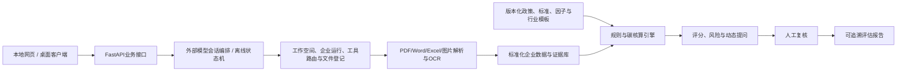

# 项目主上下文

**版本**：v1.2
**日期**：2026-08-19
**状态**：M1整改与M2核心基线已通过01正式审查和集成；M3专业Agent工作台等待02获得精确口令后实施；Windows和报告扩展后置
**项目负责人/主要软件开发者/技术集成人**：若翎
**适用对象**：项目成员、项目成员各自的Codex、只读型研究或评审Agent

## 1. 项目背景

项目参加第五届中国研究生金融科技创新大赛“揭榜挂帅”赛道第27题，由江西普惠征信命题，题目为“碳迹可循，绿贷智评：基于多维度数据与行业标准的企业转型金融评估系统”。赛题要解决的现实问题是：高耗能、高排放行业企业需要获得转型金融支持，但金融机构在主体识别、行业标准落地、能耗与排放核算、转型计划判断、持续监测和证据留存方面缺少统一、可解释、可规模化的工具。

## 2. 赛题要求与材料结论

赛题书提出五类技术攻关问题：

1. 将分散的行业标准、折标系数和排放因子结构化为可执行的规则与计算引擎；
2. 支持多行业差异化适配，而不是为单一行业重复定制；
3. 处理企业填报中的缺失、异常、口径不一致和质量追溯问题；
4. 结合行业基准与最佳实践，形成企业场景识别、转型路径和决策支持；
5. 通过智能动态提问补充关键转型特征，并把自然语言回答与结构化数据融合。

赛题目标包括覆盖8个重点行业、规则提取准确率不低于90%、数据补全准确率不低于85%、核算与人工结果偏差不超过2%、核心计算性能目标、场景识别与路径建议、用户满意度和动态提问专项指标。所有目标值目前都只是赛题目标或待验证指标，不是本项目已取得的实测结果。

参赛指南要求初赛提交精益画布、可运行项目成果、技术文档和原创性声明，并接受统一可运行性测试；决赛现场路演不超过8分钟，演示视频不超过1分钟。参赛指南当前记录的报名截止为2026-08-17，作品提交截止为2026-08-31 15:00；提交和测试日期仍应以组委会后续通知为准。

## 3. 项目定位

本项目不是只判断企业“当前是否绿色”的普通绿色评分系统，而是评估高排放企业是否具有可信、可执行、可融资、可持续监测的转型计划。关注重点包括：

- 企业及项目是否满足转型金融准入和排除要求；
- 能耗、碳排放、行业基准和核算边界是否一致、完整、可追溯；
- 转型目标、技术路线、时间表、资本开支和责任机制是否闭环；
- 是否存在数据矛盾、防碳锁定、重大环境或社会风险；
- 金融用途、KPI、融资里程碑和贷后复评如何与转型行动连接。

系统输出是授信审查、额度和定价分析、贷后监测及企业改进任务的辅助依据，不自动作出授信通过或拒绝决定。

## 4. 金融业务价值

面向金融机构，系统拟提供：

1. 转型主体及项目的准入辅助判断；
2. 能耗、碳排放、行业位置和证据来源的统一核算；
3. 转型计划可信度、实施风险、数据缺口和红旗提示；
4. 支持授信审查、额度测算、定价和贷后监测的可解释材料；
5. 可分配给企业的改进任务、融资里程碑和年度复评依据。

面向企业，系统拟把复杂标准转化为可理解的材料清单、补充问题、核算结果、转型路径和整改建议，降低准备转型融资材料的门槛。

## 5. 最终交付目标

最终目标是形成一套可运行、可测试、可部署的系统和完整竞赛材料，至少包括：

- 多模态企业材料上传与解析；
- 企业经营、能源、排放、设备、工艺、转型目标和融资需求信息提取；
- 数据标准化、质量检查、人工复核和证据链；
- 版本化政策、行业模板、能耗折标系数和碳排放因子；
- 能耗与碳排放核算、转型评分、风险红旗和动态补充提问；
- 评估报告生成，并能定位关键结论的原文、页码、表格、单元格或坐标；
- 本地网页运行，以及Windows和macOS桌面封装目标；
- 精益画布、技术文档、原创性声明、竞赛报告、演示和答辩材料。

## 6. 评估体系

### 6.1 评估流程

先执行准入与排除规则，再计算评分；数据可信度、评估得分和风险红旗分开呈现。建议流程为：材料登记 → 解析与抽取 → 数据质量分级 → 人工复核 → 行业规则匹配 → 能耗/碳排放核算 → 转型评分 → 风险识别 → 动态补问 → 证据链报告。

### 6.2 暂定100分框架

| 维度 | 暂定权重 | 说明 |
|---|---:|---|
| 碳排放基线与行业位置 | 20 | 核算边界、能耗折标、排放结果和行业基准位置 |
| 转型目标及路径可信度 | 25 | 基准年、目标年、中期节点、技术路线和可执行性 |
| 行动与资本开支 | 20 | 项目清单、CAPEX/OPEX、预期减排、进度和责任人 |
| 治理披露与验证 | 15 | 董事会监督、披露、第三方核验和内部控制 |
| 防碳锁定与环境社会保障 | 10 | 技术成熟度、长期锁定风险和环境社会影响 |
| 融资用途与KPI监测 | 10 | 资金用途、还款来源、挂钩KPI和贷后复评 |

准入门、权重、阈值、行业基准和等级边界均为专业判断初稿；配套模拟数据完成字段与质量审计，并取得独立数据字典、正式评分标签、训练/测试划分和命题方标准后，才可审计、校准并保留版本记录。

数据可信度独立输出A—D级，关注完整性、时效性、一致性、原始凭证覆盖、抽取置信度和人工复核状态。风险红旗包括数据矛盾、边界缺失、目标无中期节点、路径依赖未成熟技术、资本开支不匹配、重大负面环境影响和关键结论无证据。

## 7. 技术架构

目标技术路线：React、TypeScript、Vite、Ant Design、ECharts；Python、FastAPI、Pydantic、SQLAlchemy；桌面版SQLite、服务器版PostgreSQL；本地不可变原件目录与SHA-256；PyMuPDF/pdfplumber、python-docx、openpyxl、PaddleOCR；JSON/YAML行业模板；Jinja2、ReportLab、python-docx；PyWebView和PyInstaller。具体版本、生产配置、签名、公证和服务器规格仍需后续确认。

当前正式基线实际使用静态HTML/CSS/JavaScript、Python、FastAPI、Pydantic、原生`sqlite3`、`openpyxl`、PDF/DOCX/图片解析适配、OpenAI兼容会话模型、PyWebView和PyInstaller。React技术栈将在M3接入；SQLAlchemy、PostgreSQL、LangChain、LangGraph、知识检索、正式碳核算和评分引擎尚未接入。项目文档必须把目标技术与实际接入分开表述。

智能会话模式使用外部大模型调度当前评估运行：理解用户意图、规划步骤、调用受控工具、生成动态补问并解释结构化结果。一个工作空间可包含多个企业运行，但每次运行只绑定一家企业。模型选择器只选择会话调度模型；规则、因子、评分和行业模板在独立评估配置中管理。模型可以适度参与非结构化抽取、候选分析和文字生成，但不能篡改事实、公式或直接作出授信决定。为统一可运行性测试保留离线固定流程模式；多模态模型输出仍须结构校验、证据绑定和低置信度人工复核。

LangChain作为可选的模型、工具、提示和Agent集成层；LangGraph作为需要持久化检查点、暂停恢复或人工确认时的可选有状态编排运行时。两者可以结合，但不替代FastAPI业务状态、规则引擎和证据库。

## 8. 开发里程碑与MVP范围

02下一阶段以[`DEVELOPMENT_BRIEF.md`](DEVELOPMENT_BRIEF.md) v0.6与[`M3_DEVELOPMENT_PROMPT.md`](M3_DEVELOPMENT_PROMPT.md) v1.0为执行依据；01只负责方案、审查、正式合并和Git操作，不承担日常编码。

M1整改与M2核心基线已完成正式审查。当前覆盖配套Excel自动加载/上传、五表校验、企业代号关联、详情展示、2024—2025能耗变化、缺失提示、目录匹配、参考结论隔离、多企业工作空间、单运行隔离、多模态适配、受控模型编排、基础对比/输出和macOS桌面入口。全量Python测试在允许本机端口的环境中为`54 passed`，5条警告来自第三方PDF依赖弃用提示。

若翎已确认保持“一个工作空间多企业、一次评估运行一企业”的内部模型。M3将当前信息密集型静态页面迁移为React专业Agent工作台：左侧为工作空间和企业运行，中间为简洁会话，右侧为可折叠评估检查器。配套模拟工作簿是默认主数据集，补充文件只归入当前运行。模型选择器只选择会话调度模型，规则/评分配置保持独立。

M3不同时接入LangGraph/LangChain、知识检索、正式碳核算、行业对标、评分、Windows和报告扩展。M4再根据暂停恢复、人工介入和长流程需要引入LangGraph状态运行时与LangChain组件；M5建设知识检索；M6—M8依次推进碳核算、行业对标/转型行为、评分与信贷支持。Windows和报告扩展在核心评估链稳定后处理。

M1和M2均不改变完整“8行业框架＋2行业深验”MVP范围，也不代表正式评分、碳核算、模型效果或真实业务效果已经完成。精确开发口令“开始开发MVP”继续作为启动新开发实施的长期权限边界；具体实施统一由02执行。

完整MVP范围概括为“8行业框架＋2行业深验”，并包含以下可运行、可测试、可追溯能力：

MVP必须完整保留以下范围，不得因单个成员开发压力而删除或改成仅展示：

- 五类材料上传与解析：原生/扫描PDF、DOCX、XLSX、图片；
- OCR、表格识别、结构化抽取和人工复核；
- 数据质量检查、字段缺口和冲突提示；
- 规则与因子版本管理、可回放公式和证据定位；
- 能耗折标、碳排放核算和行业基准接口；
- 8行业配置框架，以及2个行业深度核验；
- 铜产业作为第一深验行业，第二深验行业待配套模拟数据审计、正式标准和评审需要进一步确认；
- 动态提问，最多5轮的系统边界；
- 评分、风险红旗、改进建议和可追溯PDF/DOCX报告；
- 本地网页系统，以及Windows/macOS桌面构建目标。

后续增强包括8行业完整核验、知识图谱、模型化路径排序、SSO、多租户、MinIO、分布式任务和贷后年度复评。动态知识图谱动画、情景仪表盘和模拟利率变化只可作为明确标注的展示功能。权重阈值、行业基准、场景分类模型、数据补全模型、推荐相关性、准确率提升和用户采纳率依赖正式数据或真实测试，当前不得写成成果。

## 9. 正式数据状态

命题方配套模拟数据已经取得，登记文件为：`27-多模态技术与数据治理赛道-碳迹可循，绿贷智评：基于多维度数据与行业标准的企业转型金融评估系统/配套数据.xlsx`。该工作簿来自命题方配套数据包，已脱敏、模拟生成，仅用于比赛开发和测试，不是真实企业业务数据，不能用于真实企业融资认定、碳核算或授信结论。原始工作簿、ZIP和解压目录均保存在本地受控目录，不上传公开GitHub。

当前仍未取得独立数据字典、训练/测试划分和正式评分标签。赛题书所述1000户企业、2024—2025年、11个行业、500余条问答、30组对话及160家企业参数库，只有被本地配套文件实际支持的部分可作为本次数据登记事实，其余仍属于赛题描述或待确认信息。

工作簿的使用边界已确认：`基本信息`、`能耗信息`、`补充信息`为主要输入；`转型目录`为规则与知识来源；`转型规划结论`仅作参考结论和验证对照，不得作为同一模型的输入特征，避免标签泄漏和结果回灌。03已提交初步审计：四张企业表的企业代号闭合、字段类型、缺失/重复、单位观察、语义一致性、目录覆盖缺口和泄漏风险已形成事实性归档；完整字段字典、权威规则、缺失处置、目录稳定ID和标签划分仍待确认。详见 [`DATA_PROFILE.md`](DATA_PROFILE.md)；候选契约见 [`DATA_CONTRACT.md`](DATA_CONTRACT.md)。

精确开发口令“开始开发MVP”继续作为启动新开发实施的权限边界；“继续执行”“按照计划开展”或“实施计划”均不能替代该口令。M3及后续程序实现均由02根据最新版开发指导执行，01不直接编写程序。

## 10. 团队结构与固定对话

团队共5人：若翎、吴、钟、刘、夏。若翎是主要软件开发者、技术架构负责人和最终技术集成人；其他成员不绑定固定岗位，可按实际需要参与政策标准、评分规则、数据治理、软件建议、测试、报告、精益画布、演示答辩和材料检查。

若翎长期只保留少量固定Codex对话：`00_项目上下文整理与Codex交接包`已完成、可归档；`01_项目总控与决策`负责总体计划、重大决策、状态、成员成果审查、正式合并和Git操作；`02_软件开发`负责获得授权后的程序架构、开发、测试、封装与部署；`03_数据、政策与评分体系`负责正式数据审计、政策标准、行业规则与评分校准；`04_报告、PPT与答辩`待程序、数据和评分体系基本稳定后再创建。多个固定对话不等于自动调用子Agent，子Agent默认关闭，仅在若翎明确要求或明显适合并行只读分析时使用。

正式仓库为公开个人GitHub仓库 <https://github.com/RuoLing0802/transition-finance-assessment>，无需成员加入Collaborator；GitHub采用单向同步，其他成员只clone、pull和读取，完成后把成果直接发送给若翎。成员无需登记任务编号、创建任务卡或生成固定交接包。`01_项目总控与决策`先区分新增、重复、冲突、过时和待确认内容，给出“建议采纳、部分采纳、暂不采纳”的审查结论，待若翎确认后再写入正式项目、提交和推送。具体规则见 [`TEAM_ROLES.md`](TEAM_ROLES.md) 与 [`SYNC_WORKFLOW.md`](SYNC_WORKFLOW.md)。

## 11. 当前进度、已确认决策与风险

### 当前进度

- 已完成：目标赛题书、参赛指南、精益画布模板、项目提示词、README和往届经验图的材料分析；总体定位、评估框架、技术架构和完整MVP已形成正式规划。
- 已完成：将规划与决策整理为可移植的项目交接文档，并完成文件引用、状态边界和跨文件一致性检查。
- 已完成：将旧的强制任务卡、任务编号和固定交接包机制替换为固定对话、成员直接交付和项目总控审查的精简协作机制。
- 已完成：登记命题方配套模拟数据的来源、文件大小、工作表、SHA-256及ZIP内外文件一致性；确认工作表输入/规则/参考结论边界。
- 已完成：03提交的配套数据初步审计结果已由`01`区分事实与候选方案并归档；四表主键闭合、主要缺失与重复、单位观察、语义一致性、目录覆盖缺口和参考结论隔离边界已写入正式文档。
- 已完成：M1整改与M2核心基线已通过01审查；全量Python回归为`54 passed`，参考结论泄漏隔离和运行级企业隔离继续有效。
- 已完成：[`DEVELOPMENT_REVIEW.md`](DEVELOPMENT_REVIEW.md) v0.2、[`DEVELOPMENT_BRIEF.md`](DEVELOPMENT_BRIEF.md) v0.6与[`M3_DEVELOPMENT_PROMPT.md`](M3_DEVELOPMENT_PROMPT.md) v1.0已形成正式审查及下一阶段执行依据。
- 下一步：若翎在02发送精确口令后，由02实施M3 React专业Agent工作台；由01进行里程碑审查和正式集成。03并行继续核验数据字典、字段口径、标签、目录来源、排放因子和折标系数。
- 尚未开始或尚未完成：React前端迁移、LangGraph/LangChain、知识检索、正式评分校准、碳核算、行业对标、模型效果验证、Windows交付、生产部署和竞赛最终材料制作。
- 当前缺口：独立数据字典、训练/测试划分、正式评分标签、标准全文、排放因子和部分行业资料未齐；宽转长、缺失等级、质量阻断、目录`rule_id`、评分权重、阈值、模型和第二深验行业待确认。这些缺口影响校准与后续实现，但不改变既有MVP范围。

### 主要风险

| 风险 | 后果 | 当前应对 |
|---|---|---|
| 正式数据延迟或口径变化 | 无法校准权重、阈值和模型效果 | 先做数据契约、接口和规则框架；不虚构结果 |
| 标准全文或版本不全 | 无法宣称行业深验完成 | 建立来源、版本、生效期和适用范围清单 |
| 5人团队开发资源集中于若翎 | 全部MVP并行推进风险高 | 其他成员承担研究、规则、金标准、测试和材料验收；采用纵向闭环和模块化 |
| 外部模型故障或幻觉 | 错误建议、不可解释、服务中断或成本波动 | 工具白名单、规则优先、证据绑定、人工复核和离线流程回退 |
| 行业差异过大 | 铜规则被错误复制到其他行业 | 行业模板、公式和因子接口隔离 |
| 桌面封装与跨平台部署 | 无法通过统一可运行性测试 | 单独列入构建和干净环境验收；签名、公证和服务器规格待确认 |
| 匿名性和时间压力 | 材料被扣分或错过提交 | 统一检查学校/Logo/元数据；按参赛指南锁定提交缓冲 |

## 12. 其他文档索引

- [`AGENTS.md`](../AGENTS.md)：项目统一规则和安全边界。
- [`README.md`](../README.md)：项目入口和目录说明。
- [`PROJECT_PLAN.md`](PROJECT_PLAN.md)：总体方案、实施阶段和MVP。
- [`PROJECT_STATUS.md`](PROJECT_STATUS.md)：当前状态、行动和阻塞。
- [`DECISIONS.md`](DECISIONS.md)：重大决策及是否可重新讨论。
- [`DATA_STATUS.md`](DATA_STATUS.md)：数据状态、字段建议和审计流程。
- [`DATA_PROFILE.md`](DATA_PROFILE.md)：配套数据初步画像与事实性审计归档。
- [`DATA_CONTRACT.md`](DATA_CONTRACT.md)：初步审计后的候选数据契约与待确认项。
- [`DATA_AUDIT_REVIEW_AND_FLOW_READINESS.md`](DATA_AUDIT_REVIEW_AND_FLOW_READINESS.md)：审计复核、问题完善顺序和流程软件准备清单。
- [`DEVELOPMENT_REVIEW.md`](DEVELOPMENT_REVIEW.md)：M1/M2成果审查、产品模块、技术栈与实际接入状态。
- [`DEVELOPMENT_BRIEF.md`](DEVELOPMENT_BRIEF.md)：02开发契约、M2基线和阶段边界。
- [`M3_DEVELOPMENT_PROMPT.md`](M3_DEVELOPMENT_PROMPT.md)：02实施M3专业Agent工作台的正式提示词。
- [`TEAM_ROLES.md`](TEAM_ROLES.md)：固定Codex对话、5人动态分工和成果审查机制。
- [`TASK_BOARD.md`](TASK_BOARD.md)：可选的简要待办清单。
- [`SKILLS_MANIFEST.md`](SKILLS_MANIFEST.md)：Skills清单、作用和替代方案。
- [`CODEX_ONBOARDING.md`](CODEX_ONBOARDING.md)：其他成员的Codex接入提示词。
- [`SYNC_WORKFLOW.md`](SYNC_WORKFLOW.md)：单向GitHub、成员直接交付和项目总控接收流程。
- [`../handoffs/README.md`](../handoffs/README.md)：可选的成员成果存档入口。
