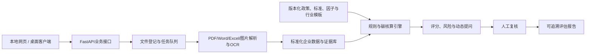

# 项目主上下文

**版本**：v0.2
**日期**：2026-08-09
**状态**：材料审阅与总体规划完成；开发未授权（只有精确口令“开始开发MVP”才可开启）
**项目负责人/主要软件开发者/技术集成人**：若翎
**适用对象**：项目成员、项目成员各自的Codex、只读型研究或评审Agent

## 1. 项目背景

项目参加第五届中国研究生金融科技创新大赛“揭榜挂帅”赛道第27题，由江西普惠征信命题，题目为“碳迹可循，绿贷智评：基于多维度数据与行业标准的企业转型金融评估系统”。赛题要解决的现实问题是：高耗能、高排放行业企业需要获得转型金融支持，但金融机构在主体识别、行业标准落地、能耗与排放核算、转型计划判断、持续监测和证据留存方面缺少统一、可解释、可规模化的工具。

## 2. 赛题要求与材料结论

赛题书提出五类技术攻关问题：

1. 将分散的行业标准、折标系数和排放因子结构化为可执行的规则与计算引擎；
2. 支持多行业差异化适配，而不是为单一行业重复定制；
3. 处理企业填报中的缺失、异常、口径不一致和质量追溯问题；
4. 结合行业基准与最佳实践，形成企业场景识别、转型路径和决策支持；
5. 通过智能动态提问补充关键转型特征，并把自然语言回答与结构化数据融合。

赛题目标包括覆盖8个重点行业、规则提取准确率不低于90%、数据补全准确率不低于85%、核算与人工结果偏差不超过2%、核心计算性能目标、场景识别与路径建议、用户满意度和动态提问专项指标。所有目标值目前都只是赛题目标或待验证指标，不是本项目已取得的实测结果。

参赛指南要求初赛提交精益画布、可运行项目成果、技术文档和原创性声明，并接受统一可运行性测试；决赛现场路演不超过8分钟，演示视频不超过1分钟。参赛指南当前记录的报名截止为2026-08-17，作品提交截止为2026-08-31 15:00；提交和测试日期仍应以组委会后续通知为准。

## 3. 项目定位

本项目不是只判断企业“当前是否绿色”的普通绿色评分系统，而是评估高排放企业是否具有可信、可执行、可融资、可持续监测的转型计划。关注重点包括：

- 企业及项目是否满足转型金融准入和排除要求；
- 能耗、碳排放、行业基准和核算边界是否一致、完整、可追溯；
- 转型目标、技术路线、时间表、资本开支和责任机制是否闭环；
- 是否存在数据矛盾、防碳锁定、重大环境或社会风险；
- 金融用途、KPI、融资里程碑和贷后复评如何与转型行动连接。

系统输出是授信审查、额度和定价分析、贷后监测及企业改进任务的辅助依据，不自动作出授信通过或拒绝决定。

## 4. 金融业务价值

面向金融机构，系统拟提供：

1. 转型主体及项目的准入辅助判断；
2. 能耗、碳排放、行业位置和证据来源的统一核算；
3. 转型计划可信度、实施风险、数据缺口和红旗提示；
4. 支持授信审查、额度测算、定价和贷后监测的可解释材料；
5. 可分配给企业的改进任务、融资里程碑和年度复评依据。

面向企业，系统拟把复杂标准转化为可理解的材料清单、补充问题、核算结果、转型路径和整改建议，降低准备转型融资材料的门槛。

## 5. 最终交付目标

最终目标是形成一套可运行、可测试、可部署的系统和完整竞赛材料，至少包括：

- 多模态企业材料上传与解析；
- 企业经营、能源、排放、设备、工艺、转型目标和融资需求信息提取；
- 数据标准化、质量检查、人工复核和证据链；
- 版本化政策、行业模板、能耗折标系数和碳排放因子；
- 能耗与碳排放核算、转型评分、风险红旗和动态补充提问；
- 评估报告生成，并能定位关键结论的原文、页码、表格、单元格或坐标；
- 本地网页运行，以及Windows和macOS桌面封装目标；
- 精益画布、技术文档、原创性声明、竞赛报告、演示和答辩材料。

## 6. 评估体系

### 6.1 评估流程

先执行准入与排除规则，再计算评分；数据可信度、评估得分和风险红旗分开呈现。建议流程为：材料登记 → 解析与抽取 → 数据质量分级 → 人工复核 → 行业规则匹配 → 能耗/碳排放核算 → 转型评分 → 风险识别 → 动态补问 → 证据链报告。

### 6.2 暂定100分框架

| 维度 | 暂定权重 | 说明 |
|---|---:|---|
| 碳排放基线与行业位置 | 20 | 核算边界、能耗折标、排放结果和行业基准位置 |
| 转型目标及路径可信度 | 25 | 基准年、目标年、中期节点、技术路线和可执行性 |
| 行动与资本开支 | 20 | 项目清单、CAPEX/OPEX、预期减排、进度和责任人 |
| 治理披露与验证 | 15 | 董事会监督、披露、第三方核验和内部控制 |
| 防碳锁定与环境社会保障 | 10 | 技术成熟度、长期锁定风险和环境社会影响 |
| 融资用途与KPI监测 | 10 | 资金用途、还款来源、挂钩KPI和贷后复评 |

准入门、权重、阈值、行业基准和等级边界均为专业判断初稿，正式数据和命题方标准到达后必须审计、校准并保留版本记录。

数据可信度独立输出A—D级，关注完整性、时效性、一致性、原始凭证覆盖、抽取置信度和人工复核状态。风险红旗包括数据矛盾、边界缺失、目标无中期节点、路径依赖未成熟技术、资本开支不匹配、重大负面环境影响和关键结论无证据。

## 7. 技术架构

已确认技术路线：React、TypeScript、Vite、Ant Design、ECharts；Python、FastAPI、Pydantic、SQLAlchemy；桌面版SQLite、服务器版PostgreSQL；本地不可变原件目录与SHA-256；PyMuPDF/pdfplumber、python-docx、openpyxl、PaddleOCR；JSON/YAML行业模板；Jinja2、ReportLab、python-docx；PyWebView和PyInstaller。具体版本、生产配置、签名、公证和服务器规格仍需后续确认。

交付系统中的外部大模型默认关闭，以保证断网可运行、成本可控和失败回退；多模态模型是可替换增强组件，必须服从规则优先、结构校验、证据绑定和低置信度人工复核。研究和开发任务可按需要调用外部模型，不受数据外传、隐私或保密限制。

## 8. MVP范围

MVP必须完整保留以下范围，不得因单个成员开发压力而删除或改成仅展示：

- 五类材料上传与解析：原生/扫描PDF、DOCX、XLSX、图片；
- OCR、表格识别、结构化抽取和人工复核；
- 数据质量检查、字段缺口和冲突提示；
- 规则与因子版本管理、可回放公式和证据定位；
- 能耗折标、碳排放核算和行业基准接口；
- 8行业配置框架，以及2个行业深度核验；
- 铜产业作为第一深验行业，第二深验行业待正式数据和标准到达后确定；
- 动态提问，最多5轮的系统边界；
- 评分、风险红旗、改进建议和可追溯PDF/DOCX报告；
- 本地网页系统，以及Windows/macOS桌面构建目标。

后续增强包括8行业完整核验、知识图谱、模型化路径排序、SSO、多租户、MinIO、分布式任务和贷后年度复评。动态知识图谱动画、情景仪表盘和模拟利率变化只可作为明确标注的展示功能。权重阈值、行业基准、场景分类模型、数据补全模型、推荐相关性、准确率提升和用户采纳率依赖正式数据或真实测试，当前不得写成成果。

## 9. 正式数据状态

当前目录没有正式参赛数据、数据字典、标签、训练/测试划分或数据领取说明。赛题书描述了1000户企业、2024—2025年、11个行业、500余条问答和30组模拟对话，并另述160家企业数据与行业标准参数库；这些内容均只是赛题材料描述。赛题还说明其配套数据为脱敏、模拟生成、仅用于比赛开发与测试，不能作为真实企业融资认定或授信依据；但本项目目前尚未取得这些配套数据文件。

在数据到达前，可以产出数据需求、接口契约、质量规则和校准方案；收到“开始开发MVP”口令后，也可使用明确标注的最小测试样例推进架构、解析、规则引擎、报告、网页、桌面和部署工程。测试样例不得用于证明正式比赛效果。数据到达后的审计流程见 [`DATA_STATUS.md`](DATA_STATUS.md)。

当前阶段锁定为规划阶段。只有用户明确发送完全一致的口令“开始开发MVP”，才允许进入程序开发；“继续执行”“按照计划开展”或“实施计划”均不能替代该口令。

## 10. 团队结构

团队共5人：若翎、吴、钟、刘、夏。若翎是主要软件开发者、技术架构负责人和最终技术集成人；其他成员不绑定固定岗位，所有人按 [`TASK_BOARD.md`](TASK_BOARD.md) 的任务卡动态参与政策标准、评分规则、数据治理、软件辅助、测试、报告、精益画布、演示答辩和材料检查。GitHub采用单向同步：若翎维护正式版本，其他成员只获取更新，成果以文件交付包返回。具体对话划分、交付格式和验收机制见 [`TEAM_ROLES.md`](TEAM_ROLES.md) 与 [`SYNC_WORKFLOW.md`](SYNC_WORKFLOW.md)。

## 11. 当前进度、已确认决策与风险

### 当前进度

- 已完成：目标赛题书、参赛指南、精益画布模板、项目提示词、README和往届经验图的材料分析；总体定位、评估框架、技术架构、MVP和动态协作机制已形成初稿/决策登记。
- 已完成：将规划与决策整理为可移植的项目交接文档，并完成文件引用、状态边界和跨文件一致性检查。
- 正在进行：等待其他成员和各自Codex读取交接包，按任务台账建立独立对话并反馈理解和缺口。
- 尚未开始：正式数据审计、规则实证校准、程序开发、模型训练、系统测试、桌面封装和竞赛最终材料制作。
- 当前缺口：正式数据、数据字典、标签和划分未取得；标准全文和部分行业资料未齐；统一测试环境、附件4、决赛PPT模板和桌面签名/服务器信息待补。这些缺口影响校准和最终验证，但不阻塞工程开发。

### 主要风险

| 风险 | 后果 | 当前应对 |
|---|---|---|
| 正式数据延迟或口径变化 | 无法校准权重、阈值和模型效果 | 先做数据契约、接口和规则框架；不虚构结果 |
| 标准全文或版本不全 | 无法宣称行业深验完成 | 建立来源、版本、生效期和适用范围清单 |
| 5人团队开发资源集中于若翎 | 全部MVP并行推进风险高 | 其他成员承担研究、规则、金标准、测试和材料验收；采用纵向闭环和模块化 |
| 外部模型故障或幻觉 | 错误建议、不可解释、服务中断或成本波动 | 交付系统默认关闭；研发可调用；规则优先、证据绑定、人工复核 |
| 行业差异过大 | 铜规则被错误复制到其他行业 | 行业模板、公式和因子接口隔离 |
| 桌面封装与跨平台部署 | 无法通过统一可运行性测试 | 单独列入构建和干净环境验收；签名、公证和服务器规格待确认 |
| 匿名性和时间压力 | 材料被扣分或错过提交 | 统一检查学校/Logo/元数据；按参赛指南锁定提交缓冲 |

## 12. 其他文档索引

- [`AGENTS.md`](../AGENTS.md)：项目统一规则和安全边界。
- [`README.md`](../README.md)：项目入口和目录说明。
- [`PROJECT_PLAN.md`](PROJECT_PLAN.md)：总体方案、实施阶段和MVP。
- [`PROJECT_STATUS.md`](PROJECT_STATUS.md)：当前状态、行动和阻塞。
- [`DECISIONS.md`](DECISIONS.md)：重大决策及是否可重新讨论。
- [`DATA_STATUS.md`](DATA_STATUS.md)：数据状态、字段建议和审计流程。
- [`TEAM_ROLES.md`](TEAM_ROLES.md)：5人动态任务制、多对话工作法和交付机制。
- [`TASK_BOARD.md`](TASK_BOARD.md)：当前任务、负责人、输出路径和状态台账。
- [`SKILLS_MANIFEST.md`](SKILLS_MANIFEST.md)：Skills清单、作用和替代方案。
- [`CODEX_ONBOARDING.md`](CODEX_ONBOARDING.md)：其他成员的Codex接入提示词。
- [`SYNC_WORKFLOW.md`](SYNC_WORKFLOW.md)：单向GitHub、文件交付和“我要同步”执行规范。
- [`../handoffs/README.md`](../handoffs/README.md)：成员任务交付目录和文件交付入口。
