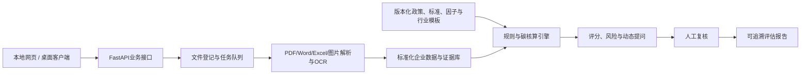

# 企业转型金融智能评估系统总体实施计划

**版本**：v1.13
**日期**：2026-08-22
**状态**：总体方案已确认；M1—M4已正式集成；11行业统一覆盖已确认；03知识资产定点整改及补充材料接收完成；M5专项开发说明已形成，等待精确口令授权；Windows和报告扩展后置
**项目负责人/主要软件开发者/技术集成人**：若翎
**计划来源**：用户确认的总体方案、2026-08-09精简协作决策、2026-08-21行业范围与知识资产准入决策及2026-08-22补充材料接收决策
**项目阶段**：M3专业Agent工作台和M4可恢复工作流完成；M5开发说明完成、软件开发尚未启动

**开发门槛**：只有收到完全一致的口令“开始开发MVP”后才进入程序开发；本计划当前不授权编程。

> 本文件是项目唯一正式总体计划。其他治理文档负责补充状态、决策、数据和协作细节；如与本文件冲突，应先登记冲突并由 `01_项目总控与决策` 提请若翎确认。所有路径均使用仓库相对路径。

## 1. 材料结论与项目定位

### 1.1 已读取的核心材料

- [目标赛题书](../项目材料/赛题与赛事/重点赛题/27-多模态技术与数据治理赛道-江西普惠征信-碳迹可循，绿贷智评：基于多维度数据与行业标准的企业转型金融评估系统.docx)：规定五类技术攻关任务、行业和数据描述、目标指标及交付成果。
- [参赛指南](../项目材料/赛题与赛事/赛事附件/附件1：第五届中国研究生金融科技创新大赛参赛指南.pdf)：规定报名、作品提交、可运行性测试、初赛材料和决赛演示要求。
- [精益画布模板](../项目材料/赛题与赛事/赛事附件/附件3：第五届中国研究生金融科技创新大赛精益画布模板.pptx)：规定初赛一页画布的表达字段和匿名要求。
- [往届经验参考](../项目材料/往届经验参考/)：8张往届经验分享图，用于了解评审偏好和表达方式，不用于照搬指标、文案、技术栈或成果。
- [项目统领提示词](../项目材料/历史规划/企业转型金融智能评估系统-项目统领提示词-计划模式.md)：历史材料审阅与总体规划输入，仅作追溯。
- [钟同学政策规则交付审查](POLICY_RULES_REVIEW.md)：记录M5候选知识源、已核验结构、内部冲突、因子禁用边界和规范化门槛。

### 1.2 赛题核心问题

赛题要求把分散的行业标准、折标系数和碳排放因子结构化为可执行规则；用行业模板适配不同高耗能行业；处理企业材料和填报中的缺失、异常与口径冲突；基于行业基准和最佳实践形成路径建议；通过动态提问补齐非结构化转型特征，并与结构化数据融合。

### 1.3 核心定位

本项目不是判断企业当前是否“绿色”的普通绿色评分系统，而是评估高排放企业是否具有可信、可执行、可融资、可持续监测的转型计划。输出包括转型主体及项目准入辅助判断、统一核算、计划可信度、风险和证据缺口、授信与贷后所需证据，以及企业改进任务和融资里程碑。

系统不得自动批准或拒绝贷款；模型或规则只能提供可解释的辅助结论，关键结论必须可追溯到原始材料、公式、参数和规则版本。

## 2. 状态分类与确认边界

本计划使用三种状态：

- **已确认**：用户已经锁定，后续实施不得擅自改变。
- **暂定方案**：用于组织开发和研究的当前方案，若有新证据需登记变更，不得静默替换。
- **待数据确认**：必须等正式数据、数据字典、标签、授权标准或真实测试到达后才能确定。

已确认的总体MVP行业边界为11行业统一覆盖：农业、冶金行业铜、冶金行业铝、化工、建材、水上运输、煤电、石化、纺织、钢铁和陶瓷。不再设置第一/第二深验。行业可以按材料成熟度分批研究和接入，但最终使用相同的来源、版本、证据、检索测试、规则回放和人工复核门槛。

命题方配套工作簿已取得并完成文件接收登记；该文件是脱敏、模拟生成的比赛开发测试数据，不是真实企业业务数据，不得据此宣称真实企业融资、碳核算、评分或模型效果。当前仍未取得独立数据字典、训练/测试划分和正式评分标签。赛题书中的1000户企业、2024—2025年、11个行业、500余条问答、30组对话及160家企业数据等内容，如未被配套文件或正式材料独立证实，仍只能写成赛题描述。

工作簿的使用边界已登记：`基本信息`、`能耗信息`、`补充信息`是主要输入；`转型目录`是规则与知识来源；`转型规划结论`仅作参考结论和验证对照，不得作为同一模型的输入特征，以避免目标泄漏。

03初步审计已报告四张企业表的企业代号一一对应、主要缺失与重复、单位观察、字段语义一致性、目录覆盖缺口和参考结论派生风险；事实性结果见 [`DATA_PROFILE.md`](DATA_PROFILE.md)。宽表转长表、缺失状态、质量阻断、目录行级`rule_id`和逻辑数据表仅是 [`DATA_CONTRACT.md`](DATA_CONTRACT.md) 中的候选方案，待若翎确认后才可进入规格冻结。

## 3. 评估体系与数据设计

### 3.1 评估流程

准入/排除规则 → 数据可信度分级 → 结构化抽取与人工复核 → 行业规则匹配 → 能耗与碳排放核算 → 转型评分 → 风险红旗 → 动态补问 → 证据链报告。

数据可信度、评分结果和风险红旗必须分开输出。暂定100分维度为：碳排放基线与行业位置20分、转型目标及路径可信度25分、行动与资本开支20分、治理披露与验证15分、防碳锁定/环境社会保障10分、融资用途与KPI监测10分。

准入门、权重、阈值、行业基准、等级边界和补全规则均属于**待数据审计、独立数据字典、正式评分标签和命题方标准确认的专业判断初稿**。03初步审计已归档，但仍需完成权威口径、目录依据、缺失/异常处置和可用性分级确认；取得独立标签、训练/测试划分和正式标准后，再重新校准。

### 3.2 建议数据契约

| 数据组 | 建议字段 | 来源与频率 | 最低质量要求 |
|---|---|---|---|
| 企业主数据 | 企业代号、行业代码、地区、报告期、组织边界 | 企业/征信平台，变更时更新 | 唯一标识、行业编码可映射 |
| 能源活动 | 能源类型、数量、单位、月份、设施、凭证号 | 能源账单和台账，月度 | 单位明确、期间连续、可定位凭证 |
| 生产经营 | 产品产量、产量单位、收入、产能利用率 | 财报和生产报表，月/季/年 | 与能耗期间一致 |
| 排放源 | 范围、气体、活动数据、因子ID、核算边界 | 核算报告和监测数据，年度 | 结果可回溯公式和因子 |
| 设备工艺 | 设备类型、投运年限、能效、工艺路线、监测状态 | 设备清单和图片，事件更新 | 型号、年限、状态可核 |
| 转型目标 | 基准年、目标年、绝对/强度目标、中期节点 | 转型计划和报告，年度 | 目标与基准口径一致 |
| 转型项目 | 技术措施、CAPEX/OPEX、预计减排、时间表、责任人 | 项目方案，季度/事件更新 | 措施、资金、减排和工期闭环 |
| 金融需求 | 金额、期限、资金用途、还款来源、挂钩KPI | 融资申请，按申请更新 | 用途与转型措施一一对应 |
| 治理与保障 | 董事会监督、披露、第三方核查、公正转型措施 | 制度和报告，年度 | 文件证据和责任主体明确 |
| 证据与质量 | 文件哈希、页码/表格/单元格/坐标、置信度、复核人 | 系统自动生成 | 关键指标至少一个证据定位 |

不允许对授信关键字段静默插补。机器补全只能作为候选值，必须记录方法、置信度和人工确认状态。

## 4. 技术路线

### 4.1 已确认目标技术选型与当前接入状态

- 前端：React、TypeScript、Vite、Ant Design、ECharts。
- 后端：Python、FastAPI、Pydantic、SQLAlchemy。
- 数据库：桌面版SQLite；服务器版PostgreSQL；通过仓储接口保持一致。
- 文件：本地不可变原件目录与SHA-256；服务器后续可切换MinIO。
- 解析：PyMuPDF/pdfplumber、python-docx、openpyxl；扫描件使用PaddleOCR及表格结构识别。
- 会话编排：外部大模型负责理解当前评估运行意图、规划步骤、调用受控工具、动态补问和解释结果；一个工作空间可以包含多个企业运行，但每次运行只绑定一家企业。至少真实接入一个若翎指定模型，同时保留离线固定流程回退。
- 编排基础设施：LangChain作为可选的模型/工具/提示/Agent集成层，LangGraph作为需要检查点、暂停恢复和人工确认时的可选有状态运行时；二者可以结合，但不得替代FastAPI业务状态、规则引擎和证据库。
- 多模态抽取：规则和格式专用解析优先，视觉语言模型作为可替换增强组件；模型输出必须绑定证据、结构校验和人工复核。
- 规则：JSON/YAML行业模板，保存来源、版本、生效日、公式、单位和测试案例。
- 动态提问：决策树/知识图谱定位关键缺失字段，运行边界最多5轮；自然语言结果须经用户确认后入库。
- 报告：Jinja2生成HTML，ReportLab生成PDF，python-docx生成可编辑DOCX。
- 部署：PyWebView封装同一前端；PyInstaller分别构建macOS `.app`/DMG和Windows `.exe`/MSI；目标部署到本地网页和Windows云服务器。
- 可观测性：结构化日志、任务状态、规则版本、错误码、审计日志和报告生成记录。

具体依赖版本、服务器配置、签名证书、公证、权限模型以及外部模型的服务商、模型版本、成本和回退方式属于后续确认项。

截至2026-08-19，当前正式基线实际使用React、TypeScript、Vite、Ant Design、ECharts前端，Python/FastAPI/Pydantic后端，原生`sqlite3`持久化，`openpyxl`及PDF/DOCX/图片解析适配，OpenAI兼容会话模型，LangGraph状态运行时、LangChain Core确定性节点包装、PyWebView和PyInstaller。SQLAlchemy、PostgreSQL、知识检索、正式碳核算、行业基准和评分引擎均尚未接入。目标架构与已接入架构不得混写。

### 4.2 核心接口方向

接口方向至少包括任务/企业绑定、消息、附件、模型能力、工具执行、人工复核、评估、证据和报告：`POST /api/v1/tasks`、`PUT /api/v1/tasks/{id}/enterprise`、`POST /api/v1/tasks/{id}/messages`、`POST /api/v1/documents`、`GET /api/v1/models`、`GET /api/v1/jobs/{job_id}`、`PUT /api/v1/extractions/{id}/review`、`POST /api/v1/question-sessions`、`POST /api/v1/assessments`、`GET /api/v1/assessments/{id}/evidence`、`POST /api/v1/reports`、`GET /api/v1/rules/versions`。

可替换接口包括 `DocumentParser`、`IndustryTemplate`、`FactorProvider`、`ScoringPolicy`、`ModelProvider`、`ReportRenderer` 和 `DataAdapter`。

## 5. MVP与后续分层

### 5.1 MVP必须实现

1. 原生PDF、扫描PDF、DOCX、XLSX、图片的上传登记与解析；
2. OCR、表格识别、结构化抽取、数据质量检查和人工复核；
3. 规则/因子版本、公式回放和证据链定位；
4. 能耗折标、碳排放核算和行业基准接口；
5. 11行业可加载、相互隔离的配置框架与公式接口；
6. 11行业分别具备来源、版本、证据、规则测试和成熟度状态，不设置深验层级；
7. 动态提问、自然语言回答结构化和最多5轮边界；
8. 评分、风险红旗、改进建议、PDF/DOCX可追溯报告；
9. 本地网页运行，以及Windows/macOS桌面构建目标。

### 5.2 后续增强

11行业知识与规则持续补齐、知识图谱、模型化路径排序、SSO、多租户、MinIO、分布式任务、贷后年度复评等，只有在核心闭环稳定后再排期，不得反向删除MVP。

### 5.3 仅作展示

动态知识图谱动画、情景仪表盘、模拟利率变化只能明确标注为展示，不得冒充正式业务结果。

### 5.4 依赖正式数据

权重、阈值、行业基准、场景分类模型、数据补全模型、推荐相关性、准确率提升、用户满意度、采纳率和真实企业结论必须依赖正式数据、标签、金标准或真实用户测试。

### 5.5 第一开发里程碑（已完成并纳入M2核心基线）

02已交付“Excel上传 → 五张表结构校验 → 按企业代号关联 → 企业详情展示 → 2024—2025年能耗变化分析 → 缺失数据提示 → `转型目录`匹配 → 基础评估报告 → 与`转型规划结论`对照验证”的主流程，并完成异常输入、批次恢复、运行隔离、参考层隔离和负向测试整改。01于2026-08-19复核全量Python测试，在允许本机端口的环境中为`54 passed`，该里程碑已纳入正式M2核心基线。

该里程碑不改变当前11行业统一覆盖范围，也不提前确定评分权重、阈值、模型或最终业务规则。运行缓存、数据库和原始数据仍不进入正式仓库。

### 5.6 第二开发里程碑（核心基线已完成）

M2核心基线当时完成M1整改、领域模型与SQLite持久化、多企业工作空间、单运行隔离、多模态适配、受控模型编排、基础报告/对比、默认配套数据自动加载与恢复，以及macOS桌面入口；当时前端仍为静态HTML/CSS/JavaScript。React前端已在后续M3接入。Windows EXE/MSI没有在真实Windows环境构建或验收，未纳入当前基线。

1000企业工作簿作为可复用数据批次导入，当前评估运行必须选择并绑定唯一企业；同一工作空间评估其他企业时创建新的运行并复用批次。对话回答、工具执行和报告只归入当前运行，发现跨企业冲突时阻断。已完成运行可生成企业对比视图，但不同期间、规则版本或口径不一致时标记不可直接比较。外部模型不可用时，离线固定流程仍完成基础解析、质量、查询、目录和基础输出闭环。M2不直接确定正式评分、碳核算、模型效果或授信结论。

### 5.7 第三开发里程碑（M3专业Agent工作台，已完成）

M3以[`DEVELOPMENT_BRIEF.md`](DEVELOPMENT_BRIEF.md) v0.6与[`M3_DEVELOPMENT_PROMPT.md`](M3_DEVELOPMENT_PROMPT.md) v1.0为02历史执行依据，已经完成React、TypeScript、Vite、Ant Design和ECharts前端迁移。界面采用可折叠三栏：左侧工作空间/企业运行，中间简洁Agent会话，右侧评估检查器；配套模拟数据是默认主数据集，补充材料归入当前企业运行。

M3只展示真实已接入能力和明确未就绪状态。碳核算、行业对标、转型行为、评分和信贷支持分别显示`not_calculable`、`pending_methodology`或`not_implemented`，没有使用假进度、假评分或模拟效果占位。M3未提前接入LangGraph、LangChain、LlamaIndex、Qdrant、RAGFlow、正式碳核算/评分、Windows或报告扩展。

### 5.8 第四开发里程碑（M4可恢复工作流，已完成）

M4已接入两类确定性评估工作流：`baseline_review`和`evidence_followup`。LangGraph只负责节点图、条件路由和运行时检查点；LangChain Core只通过`RunnableLambda`包装确定性节点。SQLite持久化`workspace_id`、`assessment_run_id`、`enterprise_id`、派生`thread_id`、版本和安全状态，并通过严格乐观锁阻止陈旧写入。

M4支持暂停、恢复、显式“暂不补充”和人工通过/退回；非法状态迁移、空回答、重复暂停和跨运行访问均受后端约束。工作流使用白名单分析视图，排除`reference_comparison`；`转型规划结论`不进入模型输入、检索、特征或标签。外部框架不可用时保留确定性离线回退。M4仍同步执行到等待点，不宣称长任务实时中断、高并发性能或真实模型工作流效果已经验证。

后续开发顺序为：M5知识检索 → M6碳核算 → M7行业对标与转型行为 → M8评分与信贷支持 → 报告扩展、Windows与正式分发。该顺序不改变11行业统一覆盖范围。M5专项开发说明已经形成，但仍须若翎在02发送完全一致的开发口令后才能启动，不因M4集成或知识材料到达自动实施。

### 5.9 M5材料准备状态

钟同学原始交付和03第二阶段知识资产已经归档，D-025列明的定点整改已完成并通过跨工作簿检查。补充材料接收又形成43份唯一政策标准PDF、12篇中文全文、14条已对照指定原件的铜行业条款和国家温室气体排放因子库入口级资源。详细边界见[`POLICY_RULES_REVIEW.md`](POLICY_RULES_REVIEW.md)及[`../团队成果/03_数据政策评分/19_补充政策文献与国家因子库接收审查.md`](../团队成果/03_数据政策评分/19_补充政策文献与国家因子库接收审查.md)。21条历史来源、15份低文本政策PDF、1份0页无效文件和7篇英文全文仍待补；新增因子允许自动调用仍为0条。

M5只建设带来源、版本、生效期、条款/表格/页码定位、状态和更新机制的知识检索层。政策知识可作为全局只读语料复用，企业附件、查询上下文和检索结果必须绑定当前`assessment_run_id`。检索结果只提供候选证据，不修改企业事实、不执行碳核算、不计算评分、不产生授信结论，也不接收`转型规划结论`或其派生文本。国家因子库在M5只登记来源和适用性元数据；因子值冻结、版本快照和计算调用留待M6单独审查。正式范围见[`POLICY_RULES_REVIEW.md`](POLICY_RULES_REVIEW.md)，具体工程实现以[`M5_DEVELOPMENT_PROMPT.md`](M5_DEVELOPMENT_PROMPT.md) v1.0为当前依据。

M5专项执行依据已形成：[`M5_DEVELOPMENT_PROMPT.md`](M5_DEVELOPMENT_PROMPT.md) v1.0。M5采用记录级白名单和四级可见性，优先实现SQLite FTS5确定性本地检索、运行级日志、候选证据引用和离线降级；不直接引入RAGFlow。12号731条候选记录当前全部`ingest_allowed=否`，只能作为治理登记和测试输入，严禁整表进入普通检索索引。若翎发送精确开发口令前，M5仍为未启动。

## 6. 团队实施方案

### 6.1 若翎的固定Codex对话

项目长期只保留少量固定对话，以成果类型划分职责，不再为每项任务建立独立编号对话：

| 对话 | 当前状态 | 职责边界 |
|---|---|---|
| `00_项目上下文整理与Codex交接包` | 已完成，可归档 | 仅保留早期上下文整理成果，不承担后续日常管理 |
| `01_项目总控与决策` | 当前主对话 | 维护本计划、重大决策和项目状态；审查成员成果；经若翎确认后正式合并、提交和推送；不承担日常软件编码 |
| `02_软件开发` | M1—M4已正式集成；M5待授权 | 按`DEVELOPMENT_BRIEF.md` v0.9和`M5_DEVELOPMENT_PROMPT.md` v1.0实施；M5不得提前实现碳核算、评分、Windows或报告扩展；成果交给01审查，不自行提交或推送 |
| `03_数据、政策与评分体系` | 钟同学政策规则阶段成果已到达，继续规范化 | 负责正式数据导入与审计、政策标准、行业规则、指标体系和评分校准；下一步统一来源ID、证据路径和规则角色，形成结论后由 `01` 更新正式计划、决策与状态 |
| `04_报告、PPT与答辩` | 暂不创建 | 待程序、数据和评分体系基本稳定后再建立 |

### 6.2 子Agent规则

- 默认不启用子Agent，也不因建立多个Codex对话而自动调用子Agent。
- 只有若翎明确要求，或任务明显适合并行只读分析时，才可调用子Agent。适用场景包括大规模文献检索、政策资料归纳、代码只读检查、测试结果分析和多方案比较。
- 正式代码和核心项目文件原则上由当前主对话统一写入，避免并行修改冲突。

### 6.3 五人团队协作

若翎负责技术架构、核心程序、前后端整合、评估引擎、桌面封装、部署和最终集成。吴、钟、刘、夏不固定绑定岗位，可根据实际需要承担政策、数据、评分、测试、报告、软件建议或其他工作。

成员第一次使用时clone若翎的正式GitHub仓库；每次开始新工作前，在没有未保存本地改动的情况下执行 `git pull --ff-only origin main`，再读取最新版项目文档。完成工作后，直接把建议、反馈、文档、代码片段、数据结果或ZIP发送给若翎。成员不向GitHub提交、不推送、不创建分支或Pull Request。

任务编号、任务卡、按任务编号命名对话、独立编号目录、`HANDOFF.md`、`SYNC_PROMPT.md`、固定ZIP结构和“我要同步”口令均不再是开始或完成工作的必要条件。[`TASK_BOARD.md`](TASK_BOARD.md) 和 [`../handoffs/`](../handoffs/) 仅作为可选待办和存档工具。

### 6.4 成员成果接收与正式合并

成员材料统一由若翎上传到 `01_项目总控与决策`。项目总控按以下顺序处理：

1. 读取成员材料并确认来源、版本和适用范围；
2. 与当前正式项目比较，区分新增、重复、冲突、过时和待确认内容；
3. 给出“建议采纳、部分采纳、暂不采纳”的审查结论及理由；
4. 等若翎确认后再修改正式项目；
5. 完成必要的文档更新、检查、Git提交和GitHub推送。

配套模拟数据接收登记和初步审计完成后，数据契约确认、字段语义、质量规则、政策标准、行业规则和评分校准仍主要在 `03_数据、政策与评分体系` 进行；`03` 的长期结论由 `01` 纳入正式文件。`转型规划结论`只能作为参考结论和验证对照，不能回流为同一模型输入特征。软件开发始终在 `02_软件开发` 进行；只有收到完全一致的口令“开始开发MVP”后才允许编程。行业范围按D-024执行11行业统一覆盖。

## 7. 21天实施节奏

以下是获得开发授权后的相对计划，不代表当前已经开始计时。若授权时间较晚，仍不得删减11行业统一覆盖范围；可以分批实现，但必须保留相同的最终验收门槛。

| 阶段 | 输入与任务 | 输出 | 验收标准 |
|---|---|---|---|
| G0 开发授权 | 精确口令、范围确认 | 开发阶段开启记录 | 未收到口令不编程；正式数据不是工程启动条件 |
| D1–D3 规格冻结 | 材料、政策、数据契约 | 数据契约、规则结构、页面流程、测试矩阵 | 每项指标有来源、负责人和测试方法 |
| D4–D9 纵向闭环 | 获批测试材料或正式数据 | 上传→抽取→复核→核算→报告闭环 | 单企业流程可重复，证据可定位 |
| D10–D14 行业与问答 | 11行业标准、目录与知识缺口 | 11行业配置、成熟度状态、动态提问 | 每行业规则有版本、检索/规则测试和回放能力 |
| D15–D17 测试与封装 | 完整MVP | Web包、Windows/macOS构建、部署说明 | 干净环境安装、启动、评估、下载成功 |
| D18–D20 竞赛交付 | 测试结果、截图、报告证据 | 技术文档、精益画布、演示脚本、原创性材料 | 匿名、指标有证据、无虚假效果声明 |
| D21 缓冲 | 最终包 | 提交压缩包和目录说明 | 按组委会截止时间完成并留回滚版本 |

若开发授权晚于计划起点，优先保住纵向闭环、11行业配置接口、统一测试和竞赛材料；行业可按成熟度分批接入，增强功能后移，但不得从MVP删除行业或降低最终门槛。

## 8. 竞赛报告大纲

1. 项目背景与金融痛点：主体识别、标准落地和业务推进难点；建议负责人：若翎统筹，政策成员供证据。
2. 政策、标准与理论：国家、江西、行业和国际框架；政策/评分成员。
3. 国内外研究与实践：转型计划评估、文档智能、可解释模型；研究/数据成员。
4. 系统总体设计：业务流程、边界和用户角色；若翎统筹。
5. 数据治理与多模态解析：数据契约、OCR、人工复核、证据模型；数据治理成员协同若翎。
6. 指标体系：准入门、六个评分维度、数据可信度和红旗；评分成员。
7. 模型与风险识别：规则基线、可解释模型边界、校准方法；若翎与评分成员。
8. 系统功能与实现：接口、数据库、部署和桌面封装；若翎。
9. 测试与案例验证：金标准、性能、跨平台和用户测试；测试成员主责。
10. 创新点：版本化标准、可追溯核算、动态提问、评分与证据解耦；全员供素材，若翎统稿。
11. 应用价值：授信准入、定价、贷后管理和企业建议；业务/政策成员。
12. 风险、合规与局限：数据缺口、模型风险、隐私和人工责任；政策/数据/测试成员。
13. 推广方案：从江西铜产业试点扩展到行业模板和机构部署；若翎与材料成员。

所有章节先建立“主张—证据—来源—验证状态”矩阵，再写正文。未完成的功能不得写成成果。

## 9. 测试、风险与确认门

测试需覆盖原生/扫描PDF、DOCX、XLSX、图片、空/损坏/加密文件；跨页表格、合并单元格、单位混用和字段冲突；能源折标、范围1/2核算、单位换算、因子版本切换；证据定位；动态提问无效回答、矛盾回答和轮次限制；规则生效日和历史重放；报告一致性；权限、脱敏、路径穿越和敏感数据外传；断网运行、干净Windows/macOS安装和服务重启恢复。

赛题的“≤3秒、≥100次/秒”只针对预解析后的核心计算引擎单独测试，不把OCR和报告生成混入；必须披露硬件、并发模型和样本规模。准确率、相关性、满意度和采纳率在无正式标签和真实用户测试前只能写测试设计。

主要风险包括正式数据延迟、标准获取不全、开发资源集中、LLM幻觉、行业差异、桌面封装、匿名性和提交时间压力。应对措施已登记在 [`PROJECT_CONTEXT.md`](PROJECT_CONTEXT.md) 与 [`PROJECT_STATUS.md`](PROJECT_STATUS.md)。

## 10. 后续计划文档

获得开发授权后，可按需新增或维护：`docs/DATA_CONTRACT.md`、`docs/SCORING_RULEBOOK.md`、`docs/ARCHITECTURE.md`、`docs/TEAM_PLAN.md`、`docs/TEST_PLAN.md`、`docs/RISK_REGISTER.md`、`docs/SUBMISSION_CHECKLIST.md`。这些文件是本计划的专项展开，不得另建与 `PROJECT_PLAN.md` 并列或冲突的总体计划。当前不启动开发；后续重大范围、数据、评分或阶段变化由 `01_项目总控与决策` 更新本文件及相应治理文档。
