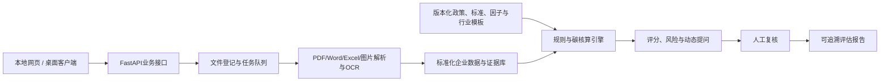

# 企业转型金融智能评估系统总体实施计划

**版本**：v1.0
**日期**：2026-08-09
**状态**：总体方案已确认；部分规则、基准和实现细节待正式数据确认
**项目负责人/主要软件开发者/技术集成人**：若翎
**计划来源**：用户确认的总体方案与2026-08-09精简协作决策
**项目阶段**：材料审阅与总体规划阶段；治理机制已精简，开发未授权

**开发门槛**：只有收到完全一致的口令“开始开发MVP”后才进入程序开发；本计划当前不授权编程。

> 本文件是项目唯一正式总体计划。其他治理文档负责补充状态、决策、数据和协作细节；如与本文件冲突，应先登记冲突并由 `01_项目总控与决策` 提请若翎确认。所有路径均使用仓库相对路径。

## 1. 材料结论与项目定位

### 1.1 已读取的核心材料

- [目标赛题书](../27-多模态技术与数据治理赛道-江西普惠征信-碳迹可循，绿贷智评：基于多维度数据与行业标准的企业转型金融评估系统.docx)：规定五类技术攻关任务、行业和数据描述、目标指标及交付成果。
- [参赛指南](../附件1：第五届中国研究生金融科技创新大赛参赛指南.pdf)：规定报名、作品提交、可运行性测试、初赛材料和决赛演示要求。
- [精益画布模板](../附件3：第五届中国研究生金融科技创新大赛精益画布模板.pptx)：规定初赛一页画布的表达字段和匿名要求。
- [`图片信息/`](../图片信息/)：8张往届经验分享图，用于了解评审偏好和表达方式，不用于照搬指标、文案、技术栈或成果。
- [项目统领提示词](../企业转型金融智能评估系统-项目统领提示词-计划模式.md)：规定材料审阅与总体规划阶段的开发锁。

### 1.2 赛题核心问题

赛题要求把分散的行业标准、折标系数和碳排放因子结构化为可执行规则；用行业模板适配不同高耗能行业；处理企业材料和填报中的缺失、异常与口径冲突；基于行业基准和最佳实践形成路径建议；通过动态提问补齐非结构化转型特征，并与结构化数据融合。

### 1.3 核心定位

本项目不是判断企业当前是否“绿色”的普通绿色评分系统，而是评估高排放企业是否具有可信、可执行、可融资、可持续监测的转型计划。输出包括转型主体及项目准入辅助判断、统一核算、计划可信度、风险和证据缺口、授信与贷后所需证据，以及企业改进任务和融资里程碑。

系统不得自动批准或拒绝贷款；模型或规则只能提供可解释的辅助结论，关键结论必须可追溯到原始材料、公式、参数和规则版本。

## 2. 状态分类与确认边界

本计划使用三种状态：

- **已确认**：用户已经锁定，后续实施不得擅自改变。
- **暂定方案**：用于组织开发和研究的当前方案，若有新证据需登记变更，不得静默替换。
- **待数据确认**：必须等正式数据、数据字典、标签、授权标准或真实测试到达后才能确定。

已确认的“8行业框架＋2行业深验”是总体MVP边界，不属于可削减项。铜产业是第一深验行业；第二深验行业待正式数据和标准到达后，按样本量、规范完整度、评委可理解性和减排金融价值确定。

当前尚无正式参赛数据、数据字典、标签和训练/测试划分。赛题书中的1000户企业、2024—2025年、11个行业、500余条问答、30组对话及160家企业数据等内容均为赛题描述，不得写成项目已取得数据。

## 3. 评估体系与数据设计

### 3.1 评估流程

准入/排除规则 → 数据可信度分级 → 结构化抽取与人工复核 → 行业规则匹配 → 能耗与碳排放核算 → 转型评分 → 风险红旗 → 动态补问 → 证据链报告。

数据可信度、评分结果和风险红旗必须分开输出。暂定100分维度为：碳排放基线与行业位置20分、转型目标及路径可信度25分、行动与资本开支20分、治理披露与验证15分、防碳锁定/环境社会保障10分、融资用途与KPI监测10分。

准入门、权重、阈值、行业基准、等级边界和补全规则均属于**待正式数据和命题方标准确认的专业判断初稿**。正式数据到达后须重新审计和校准。

### 3.2 建议数据契约

| 数据组 | 建议字段 | 来源与频率 | 最低质量要求 |
|---|---|---|---|
| 企业主数据 | 企业代号、行业代码、地区、报告期、组织边界 | 企业/征信平台，变更时更新 | 唯一标识、行业编码可映射 |
| 能源活动 | 能源类型、数量、单位、月份、设施、凭证号 | 能源账单和台账，月度 | 单位明确、期间连续、可定位凭证 |
| 生产经营 | 产品产量、产量单位、收入、产能利用率 | 财报和生产报表，月/季/年 | 与能耗期间一致 |
| 排放源 | 范围、气体、活动数据、因子ID、核算边界 | 核算报告和监测数据，年度 | 结果可回溯公式和因子 |
| 设备工艺 | 设备类型、投运年限、能效、工艺路线、监测状态 | 设备清单和图片，事件更新 | 型号、年限、状态可核 |
| 转型目标 | 基准年、目标年、绝对/强度目标、中期节点 | 转型计划和报告，年度 | 目标与基准口径一致 |
| 转型项目 | 技术措施、CAPEX/OPEX、预计减排、时间表、责任人 | 项目方案，季度/事件更新 | 措施、资金、减排和工期闭环 |
| 金融需求 | 金额、期限、资金用途、还款来源、挂钩KPI | 融资申请，按申请更新 | 用途与转型措施一一对应 |
| 治理与保障 | 董事会监督、披露、第三方核查、公正转型措施 | 制度和报告，年度 | 文件证据和责任主体明确 |
| 证据与质量 | 文件哈希、页码/表格/单元格/坐标、置信度、复核人 | 系统自动生成 | 关键指标至少一个证据定位 |

不允许对授信关键字段静默插补。机器补全只能作为候选值，必须记录方法、置信度和人工确认状态。

## 4. 技术路线

### 4.1 已确认技术选型

- 前端：React、TypeScript、Vite、Ant Design、ECharts。
- 后端：Python、FastAPI、Pydantic、SQLAlchemy。
- 数据库：桌面版SQLite；服务器版PostgreSQL；通过仓储接口保持一致。
- 文件：本地不可变原件目录与SHA-256；服务器后续可切换MinIO。
- 解析：PyMuPDF/pdfplumber、python-docx、openpyxl；扫描件使用PaddleOCR及表格结构识别。
- 多模态抽取：规则和布局解析优先，视觉语言模型作为可替换增强组件；交付系统中的外部API默认关闭，研究和开发任务可按需要调用，但必须记录服务商、模型、用途、失败回退和人工复核边界。
- 规则：JSON/YAML行业模板，保存来源、版本、生效日、公式、单位和测试案例。
- 动态提问：决策树/知识图谱定位关键缺失字段，运行边界最多5轮；自然语言结果须经用户确认后入库。
- 报告：Jinja2生成HTML，ReportLab生成PDF，python-docx生成可编辑DOCX。
- 部署：PyWebView封装同一前端；PyInstaller分别构建Windows和macOS桌面包；目标部署到本地网页和Windows云服务器。
- 可观测性：结构化日志、任务状态、规则版本、错误码、审计日志和报告生成记录。

具体依赖版本、服务器配置、签名证书、公证、权限模型以及外部模型的服务商、模型版本、成本和回退方式属于后续确认项。

### 4.2 核心接口方向

`POST /api/v1/documents`、`GET /api/v1/jobs/{job_id}`、`PUT /api/v1/extractions/{id}/review`、`POST /api/v1/question-sessions`、`POST /api/v1/assessments`、`GET /api/v1/assessments/{id}/evidence`、`POST /api/v1/reports`、`GET /api/v1/rules/versions`。

可替换接口包括 `DocumentParser`、`IndustryTemplate`、`FactorProvider`、`ScoringPolicy`、`ModelProvider`、`ReportRenderer` 和 `DataAdapter`。

## 5. MVP与后续分层

### 5.1 MVP必须实现

1. 原生PDF、扫描PDF、DOCX、XLSX、图片的上传登记与解析；
2. OCR、表格识别、结构化抽取、数据质量检查和人工复核；
3. 规则/因子版本、公式回放和证据链定位；
4. 能耗折标、碳排放核算和行业基准接口；
5. 8行业可加载的配置框架与公式接口；
6. 2个行业深验，其中铜产业固定为第一行业，第二行业待数据确认；
7. 动态提问、自然语言回答结构化和最多5轮边界；
8. 评分、风险红旗、改进建议、PDF/DOCX可追溯报告；
9. 本地网页运行，以及Windows/macOS桌面构建目标。

### 5.2 后续增强

8行业完整核验、知识图谱、模型化路径排序、SSO、多租户、MinIO、分布式任务、贷后年度复评等，只有在核心闭环稳定后再排期，不得反向删除MVP。

### 5.3 仅作展示

动态知识图谱动画、情景仪表盘、模拟利率变化只能明确标注为展示，不得冒充正式业务结果。

### 5.4 依赖正式数据

权重、阈值、行业基准、场景分类模型、数据补全模型、推荐相关性、准确率提升、用户满意度、采纳率和真实企业结论必须依赖正式数据、标签、金标准或真实用户测试。

## 6. 团队实施方案

### 6.1 若翎的固定Codex对话

项目长期只保留少量固定对话，以成果类型划分职责，不再为每项任务建立独立编号对话：

| 对话 | 当前状态 | 职责边界 |
|---|---|---|
| `00_项目上下文整理与Codex交接包` | 已完成，可归档 | 仅保留早期上下文整理成果，不承担后续日常管理 |
| `01_项目总控与决策` | 当前主对话 | 维护本计划、重大决策和项目状态；审查成员成果；经若翎确认后正式合并、提交和推送；不承担日常软件编码 |
| `02_软件开发` | 未开启开发 | 负责程序架构、前后端、数据库、测试、桌面封装和部署；只有收到完全一致的口令“开始开发MVP”后才允许开始程序开发 |
| `03_数据、政策与评分体系` | 可开展非开发研究 | 负责正式数据导入与审计、政策标准、行业规则、指标体系和评分校准；形成结论后由 `01` 更新正式计划、决策与状态 |
| `04_报告、PPT与答辩` | 暂不创建 | 待程序、数据和评分体系基本稳定后再建立 |

### 6.2 子Agent规则

- 默认不启用子Agent，也不因建立多个Codex对话而自动调用子Agent。
- 只有若翎明确要求，或任务明显适合并行只读分析时，才可调用子Agent。适用场景包括大规模文献检索、政策资料归纳、代码只读检查、测试结果分析和多方案比较。
- 正式代码和核心项目文件原则上由当前主对话统一写入，避免并行修改冲突。

### 6.3 五人团队协作

若翎负责技术架构、核心程序、前后端整合、评估引擎、桌面封装、部署和最终集成。吴、钟、刘、夏不固定绑定岗位，可根据实际需要承担政策、数据、评分、测试、报告、软件建议或其他工作。

成员第一次使用时clone若翎的正式GitHub仓库；每次开始新工作前，在没有未保存本地改动的情况下执行 `git pull --ff-only origin main`，再读取最新版项目文档。完成工作后，直接把建议、反馈、文档、代码片段、数据结果或ZIP发送给若翎。成员不向GitHub提交、不推送、不创建分支或Pull Request。

任务编号、任务卡、按任务编号命名对话、独立编号目录、`HANDOFF.md`、`SYNC_PROMPT.md`、固定ZIP结构和“我要同步”口令均不再是开始或完成工作的必要条件。[`TASK_BOARD.md`](TASK_BOARD.md) 和 [`../handoffs/`](../handoffs/) 仅作为可选待办和存档工具。

### 6.4 成员成果接收与正式合并

成员材料统一由若翎上传到 `01_项目总控与决策`。项目总控按以下顺序处理：

1. 读取成员材料并确认来源、版本和适用范围；
2. 与当前正式项目比较，区分新增、重复、冲突、过时和待确认内容；
3. 给出“建议采纳、部分采纳、暂不采纳”的审查结论及理由；
4. 等若翎确认后再修改正式项目；
5. 完成必要的文档更新、检查、Git提交和GitHub推送。

正式参赛数据到达后，数据盘点、字段审计、质量检查、规则研究和评分校准主要在 `03_数据、政策与评分体系` 进行；`03` 的长期结论由 `01` 纳入正式文件。软件开发始终在 `02_软件开发` 进行。数据未到达不改变当前“尚无正式参赛数据”的状态。

## 7. 21天实施节奏

以下是获得开发授权后的相对计划，不代表当前已经开始计时。若授权时间较晚，仍不得删减8行业框架＋2行业深验；应通过成员并行辅助和优先级安排降低开发风险。

| 阶段 | 输入与任务 | 输出 | 验收标准 |
|---|---|---|---|
| G0 开发授权 | 精确口令、范围确认 | 开发阶段开启记录 | 未收到口令不编程；正式数据不是工程启动条件 |
| D1–D3 规格冻结 | 材料、政策、数据契约 | 数据契约、规则结构、页面流程、测试矩阵 | 每项指标有来源、负责人和测试方法 |
| D4–D9 纵向闭环 | 获批测试材料或正式数据 | 上传→抽取→复核→核算→报告闭环 | 单企业流程可重复，证据可定位 |
| D10–D14 行业与问答 | 铜标准、第二行业材料 | 2个深验模板、8行业框架、动态提问 | 规则有版本、金标准案例和回放能力 |
| D15–D17 测试与封装 | 完整MVP | Web包、Windows/macOS构建、部署说明 | 干净环境安装、启动、评估、下载成功 |
| D18–D20 竞赛交付 | 测试结果、截图、报告证据 | 技术文档、精益画布、演示脚本、原创性材料 | 匿名、指标有证据、无虚假效果声明 |
| D21 缓冲 | 最终包 | 提交压缩包和目录说明 | 按组委会截止时间完成并留回滚版本 |

若开发授权晚于计划起点，优先保住纵向闭环、铜产业深验、第二行业深验、8行业框架、统一测试和竞赛材料；增强功能后移，不得从MVP删除。

## 8. 竞赛报告大纲

1. 项目背景与金融痛点：主体识别、标准落地和业务推进难点；建议负责人：若翎统筹，政策成员供证据。
2. 政策、标准与理论：国家、江西、行业和国际框架；政策/评分成员。
3. 国内外研究与实践：转型计划评估、文档智能、可解释模型；研究/数据成员。
4. 系统总体设计：业务流程、边界和用户角色；若翎统筹。
5. 数据治理与多模态解析：数据契约、OCR、人工复核、证据模型；数据治理成员协同若翎。
6. 指标体系：准入门、六个评分维度、数据可信度和红旗；评分成员。
7. 模型与风险识别：规则基线、可解释模型边界、校准方法；若翎与评分成员。
8. 系统功能与实现：接口、数据库、部署和桌面封装；若翎。
9. 测试与案例验证：金标准、性能、跨平台和用户测试；测试成员主责。
10. 创新点：版本化标准、可追溯核算、动态提问、评分与证据解耦；全员供素材，若翎统稿。
11. 应用价值：授信准入、定价、贷后管理和企业建议；业务/政策成员。
12. 风险、合规与局限：数据缺口、模型风险、隐私和人工责任；政策/数据/测试成员。
13. 推广方案：从江西铜产业试点扩展到行业模板和机构部署；若翎与材料成员。

所有章节先建立“主张—证据—来源—验证状态”矩阵，再写正文。未完成的功能不得写成成果。

## 9. 测试、风险与确认门

测试需覆盖原生/扫描PDF、DOCX、XLSX、图片、空/损坏/加密文件；跨页表格、合并单元格、单位混用和字段冲突；能源折标、范围1/2核算、单位换算、因子版本切换；证据定位；动态提问无效回答、矛盾回答和轮次限制；规则生效日和历史重放；报告一致性；权限、脱敏、路径穿越和敏感数据外传；断网运行、干净Windows/macOS安装和服务重启恢复。

赛题的“≤3秒、≥100次/秒”只针对预解析后的核心计算引擎单独测试，不把OCR和报告生成混入；必须披露硬件、并发模型和样本规模。准确率、相关性、满意度和采纳率在无正式标签和真实用户测试前只能写测试设计。

主要风险包括正式数据延迟、标准获取不全、开发资源集中、LLM幻觉、行业差异、桌面封装、匿名性和提交时间压力。应对措施已登记在 [`PROJECT_CONTEXT.md`](PROJECT_CONTEXT.md) 与 [`PROJECT_STATUS.md`](PROJECT_STATUS.md)。

## 10. 后续计划文档

获得开发授权后，可按需新增或维护：`docs/DATA_CONTRACT.md`、`docs/SCORING_RULEBOOK.md`、`docs/ARCHITECTURE.md`、`docs/TEAM_PLAN.md`、`docs/TEST_PLAN.md`、`docs/RISK_REGISTER.md`、`docs/SUBMISSION_CHECKLIST.md`。这些文件是本计划的专项展开，不得另建与 `PROJECT_PLAN.md` 并列或冲突的总体计划。当前不启动开发；后续重大范围、数据、评分或阶段变化由 `01_项目总控与决策` 更新本文件及相应治理文档。
